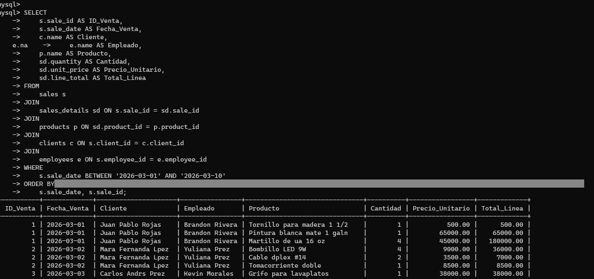

aqui empezamos mostrando la base de datos

en este paso se muestran las tablas

aqui agrego los datos relacionados entre dos tablas

usamos la sentencia BETWEEN para  empezar la comparación entre las dos tablas para asi mismo anidarlos con la sentencia AND para comparar los DATES (fechas) para completar la consulta

