# PROYECTO BASE DE DATOS II

## Sistema FerroHogar

### Trabajo Consolidado

---

## 1. INTRODUCCIÓN

El presente documento tiene como objetivo el diseño e implementación de una base de datos relacional para el sistema FerroHogar, orientado a la gestión integral de una ferretería.

El sistema permite gestionar inventario, compras, ventas, clientes, proveedores, cuentas de cobro y devoluciones, garantizando trazabilidad, integridad y control de la información.

---

## 2. OBJETIVOS

### Objetivo General

Diseñar e implementar una base de datos relacional para el sistema FerroHogar en múltiples motores de bases de datos.

### Objetivos Específicos

- Identificar entidades, atributos y relaciones del sistema.
- Diseñar el modelo entidad-relación.
- Implementar la base de datos en MySQL, PostgreSQL, SQL Server y Oracle.
- Validar el funcionamiento en distintos gestores de bases de datos.

---

## 3. ÉPICAS DEL SISTEMA

| Épica | Descripción |
|------|------------|
| Gestión de productos | Administración del inventario |
| Gestión de proveedores | Control de abastecimiento |
| Gestión de compras | Registro de entradas de mercancía |
| Gestión de clientes | Registro de clientes |
| Gestión de ventas | Control de ventas |
| Gestión de cuentas de cobro | Manejo de ventas a crédito |
| Gestión de devoluciones | Control de productos devueltos |

---

## 4. HISTORIAS DE USUARIO

- Como administrador quiero registrar productos para controlar el inventario.
- Como administrador quiero gestionar proveedores para asegurar el abastecimiento.
- Como usuario quiero registrar compras para ingresar productos al sistema.
- Como vendedor quiero registrar ventas para controlar ingresos.
- Como usuario quiero consultar clientes para asociarlos a ventas.
- Como administrador quiero gestionar cuentas de cobro para controlar créditos.
- Como usuario quiero registrar devoluciones para mantener consistencia en el sistema.

---

## 5. MODELO DE BASE DE DATOS

### Entidades principales

- products
- suppliers
- purchases
- purchase_details
- clients
- sales
- sales_details
- accounts_receivable
- returns

---

### Atributos principales

**products**
- product_id
- name
- description
- status

**suppliers**
- supplier_id
- document_type
- document_number
- name
- phone
- email
- status

**purchases**
- purchase_id
- date
- status
- subtotal
- tax
- total

**purchase_details**
- purchase_detail_id
- purchase_id (FK)
- product_id (FK)
- quantity
- unit_price
- line_total
- notes

**clients**
- client_id
- document_type
- document_number
- name
- phone
- email
- status

**sales**
- sale_id
- date
- status
- subtotal
- tax
- total

**sales_details**
- sales_detail_id
- sale_id (FK)
- product_id (FK)
- quantity
- unit_price
- line_total
- notes

**accounts_receivable**
- accounts_receivable_id
- date
- status
- subtotal
- tax
- total

**returns**
- return_id
- name
- status

---

### Relaciones

- purchases → suppliers
- purchase_details → purchases
- purchase_details → products
- sales → clients
- sales_details → sales
- sales_details → products
- accounts_receivable → sales
- returns → sales

---

## 6. DIAGRAMA ENTIDAD-RELACIÓN

> En esta sección se presentan los diagramas del modelo en cada motor.

### MySQL Dbeaver, Workbench Y Script
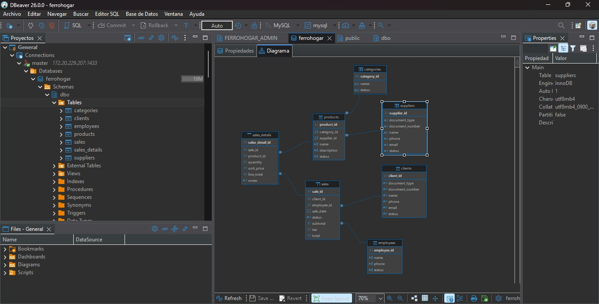
### MySQL Workbench 
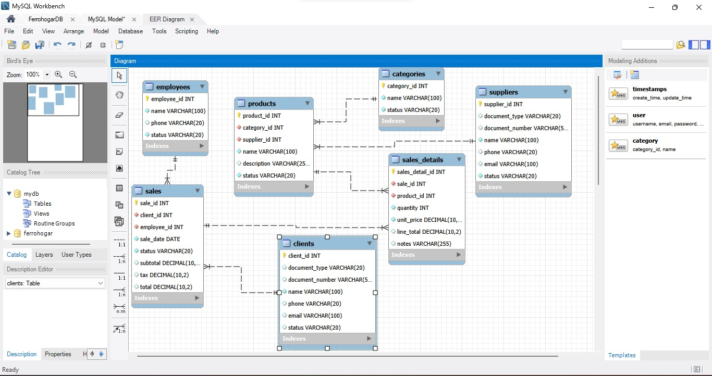
### MySQL Script
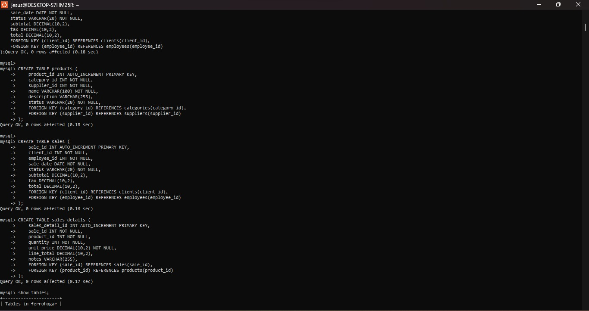

---
### PostgreSQL Dbeaver
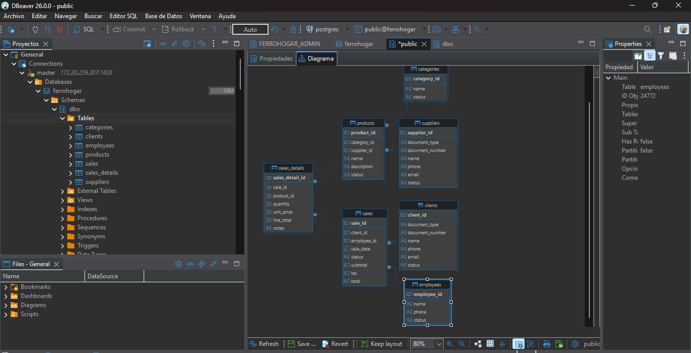
### PostgreSQL PgAdmin 4 

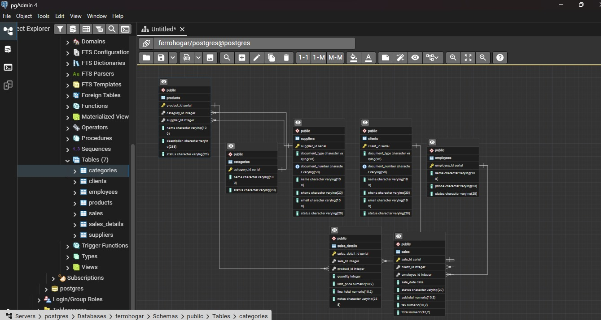
### PostgreSQL Script 

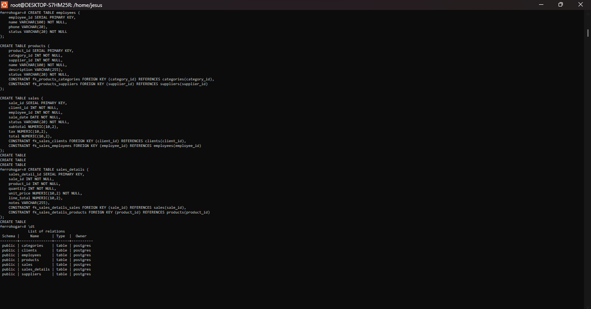

---

### SQL Server Dbeaver
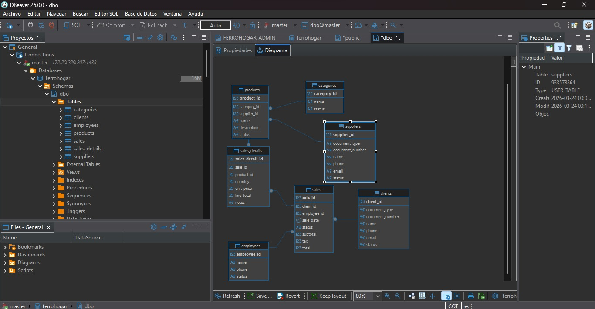
### SQL Server Manager
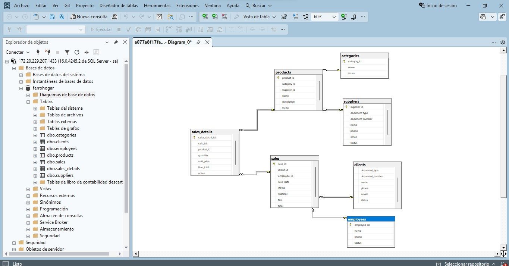
### SQL Server Script
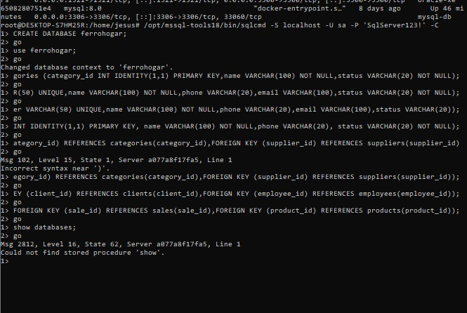

### Oracle Dbeaver
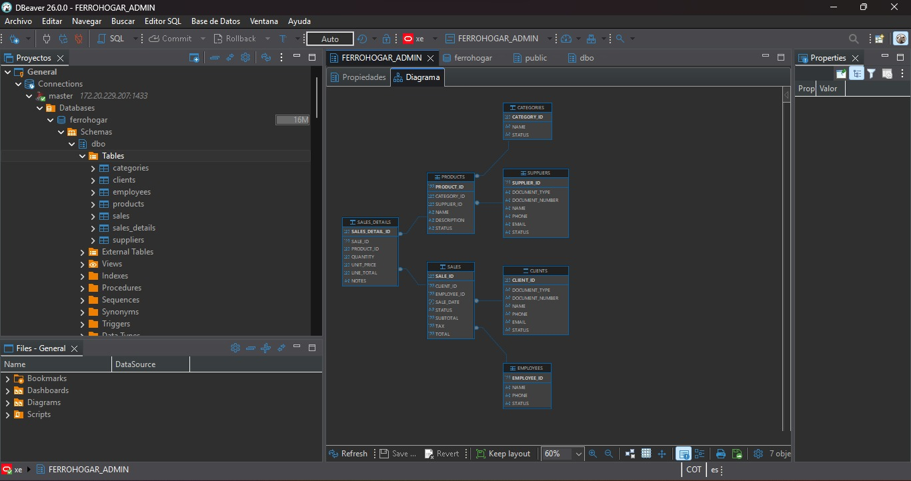
### Oracle Developer
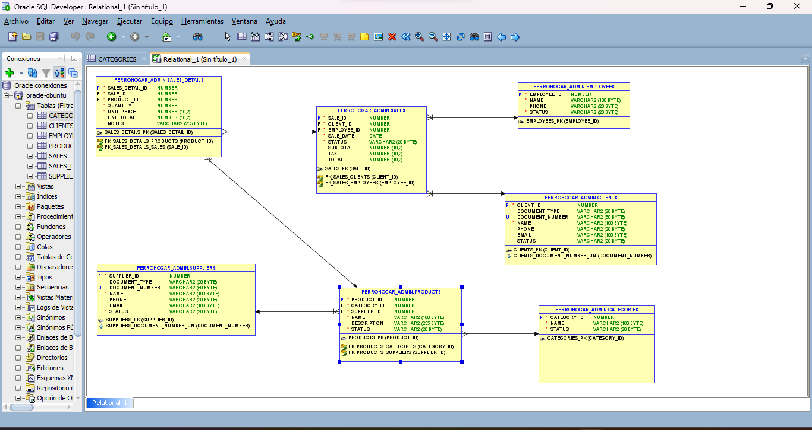
### Oracle Script
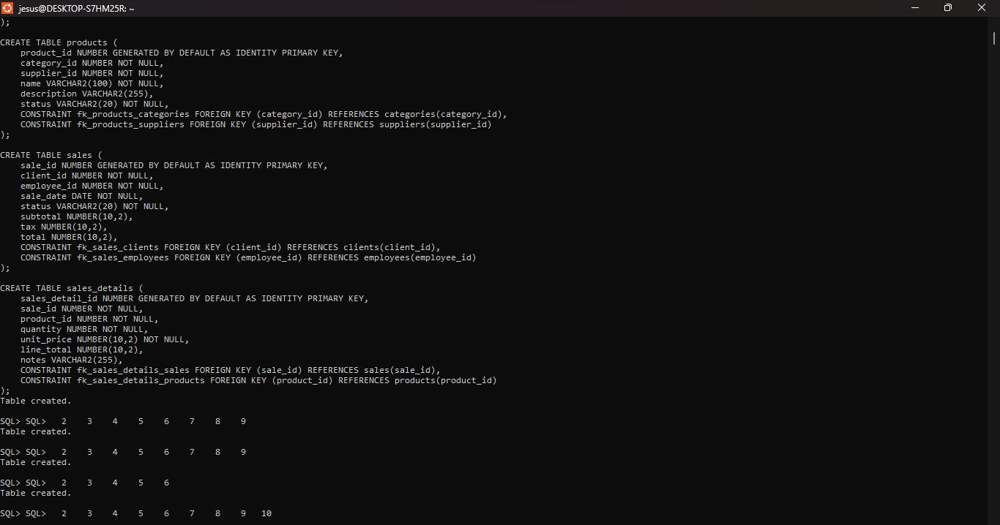


## 7. SCRIPTS DE BASE DE DATOS

### MySQL

```sql
CREATE DATABASE ferrohogar;
USE ferrohogar;

CREATE TABLE categories (
    category_id INT AUTO_INCREMENT PRIMARY KEY,
    name VARCHAR(100) NOT NULL,
    status VARCHAR(20) NOT NULL
);

CREATE TABLE suppliers (
    supplier_id INT AUTO_INCREMENT PRIMARY KEY,
    document_type VARCHAR(20),
    document_number VARCHAR(50) UNIQUE,
    name VARCHAR(100) NOT NULL,
    phone VARCHAR(20),
    email VARCHAR(100),
    status VARCHAR(20) NOT NULL
);

CREATE TABLE clients (
    client_id INT AUTO_INCREMENT PRIMARY KEY,
    document_type VARCHAR(20),
    document_number VARCHAR(50) UNIQUE,
    name VARCHAR(100) NOT NULL,
    phone VARCHAR(20),
    email VARCHAR(100),
    status VARCHAR(20)
);

CREATE TABLE employees (
    employee_id INT AUTO_INCREMENT PRIMARY KEY,
    name VARCHAR(100) NOT NULL,
    phone VARCHAR(20),
    status VARCHAR(20) NOT NULL
);

CREATE TABLE products (
    product_id INT AUTO_INCREMENT PRIMARY KEY,
    category_id INT NOT NULL,
    supplier_id INT NOT NULL,
    name VARCHAR(100) NOT NULL,
    description VARCHAR(255),
    status VARCHAR(20) NOT NULL,
    FOREIGN KEY (category_id) REFERENCES categories(category_id),
    FOREIGN KEY (supplier_id) REFERENCES suppliers(supplier_id)
);

CREATE TABLE sales (
    sale_id INT AUTO_INCREMENT PRIMARY KEY,
    client_id INT NOT NULL,
    employee_id INT NOT NULL,
    sale_date DATE NOT NULL,
    status VARCHAR(20) NOT NULL,
    subtotal DECIMAL(10,2),
    tax DECIMAL(10,2),
    total DECIMAL(10,2),
    FOREIGN KEY (client_id) REFERENCES clients(client_id),
    FOREIGN KEY (employee_id) REFERENCES employees(employee_id)
);

CREATE TABLE sales_details (
    sales_detail_id INT AUTO_INCREMENT PRIMARY KEY,
    sale_id INT NOT NULL,
    product_id INT NOT NULL,
    quantity INT NOT NULL,
    unit_price DECIMAL(10,2) NOT NULL,
    line_total DECIMAL(10,2),
    notes VARCHAR(255),
    FOREIGN KEY (sale_id) REFERENCES sales(sale_id),
    FOREIGN KEY (product_id) REFERENCES products(product_id)
);

```
### PostgreSQL

```sql
CREATE DATABASE ferrohogar;

CREATE TABLE categories (
    category_id SERIAL PRIMARY KEY,
    name VARCHAR(100) NOT NULL,
    status VARCHAR(20) NOT NULL
);

CREATE TABLE suppliers (
    supplier_id SERIAL PRIMARY KEY,
    document_type VARCHAR(20),
    document_number VARCHAR(50) UNIQUE,
    name VARCHAR(100) NOT NULL,
    phone VARCHAR(20),
    email VARCHAR(100),
    status VARCHAR(20) NOT NULL
);

CREATE TABLE clients (
    client_id SERIAL PRIMARY KEY,
    document_type VARCHAR(20),
    document_number VARCHAR(50) UNIQUE,
    name VARCHAR(100) NOT NULL,
    phone VARCHAR(20),
    email VARCHAR(100),
    status VARCHAR(20)
);

CREATE TABLE employees (
    employee_id SERIAL PRIMARY KEY,
    name VARCHAR(100) NOT NULL,
    phone VARCHAR(20),
    status VARCHAR(20) NOT NULL
);

CREATE TABLE products (
    product_id SERIAL PRIMARY KEY,
    category_id INT NOT NULL,
    supplier_id INT NOT NULL,
    name VARCHAR(100) NOT NULL,
    description VARCHAR(255),
    status VARCHAR(20) NOT NULL,
    CONSTRAINT fk_products_categories FOREIGN KEY (category_id) REFERENCES categories(category_id),
    CONSTRAINT fk_products_suppliers FOREIGN KEY (supplier_id) REFERENCES suppliers(supplier_id)
);

CREATE TABLE sales (
    sale_id SERIAL PRIMARY KEY,
    client_id INT NOT NULL,
    employee_id INT NOT NULL,
    sale_date DATE NOT NULL,
    status VARCHAR(20) NOT NULL,
    subtotal NUMERIC(10,2),
    tax NUMERIC(10,2),
    total NUMERIC(10,2),
    CONSTRAINT fk_sales_clients FOREIGN KEY (client_id) REFERENCES clients(client_id),
    CONSTRAINT fk_sales_employees FOREIGN KEY (employee_id) REFERENCES employees(employee_id)
);

CREATE TABLE sales_details (
    sales_detail_id SERIAL PRIMARY KEY,
    sale_id INT NOT NULL,
    product_id INT NOT NULL,
    quantity INT NOT NULL,
    unit_price NUMERIC(10,2) NOT NULL,
    line_total NUMERIC(10,2),
    notes VARCHAR(255),
    CONSTRAINT fk_sales_details_sales FOREIGN KEY (sale_id) REFERENCES sales(sale_id),
    CONSTRAINT fk_sales_details_products FOREIGN KEY (product_id) REFERENCES products(product_id)
);

```

### SQL Server
```sql

CREATE DATABASE ferrohogar;
GO

USE ferrohogar;
GO

CREATE TABLE categories (
    category_id INT IDENTITY(1,1) PRIMARY KEY,
    name VARCHAR(100) NOT NULL,
    status VARCHAR(20) NOT NULL
);

CREATE TABLE suppliers (
    supplier_id INT IDENTITY(1,1) PRIMARY KEY,
    document_type VARCHAR(20),
    document_number VARCHAR(50) UNIQUE,
    name VARCHAR(100) NOT NULL,
    phone VARCHAR(20),
    email VARCHAR(100),
    status VARCHAR(20) NOT NULL
);

CREATE TABLE clients (
    client_id INT IDENTITY(1,1) PRIMARY KEY,
    document_type VARCHAR(20),
    document_number VARCHAR(50) UNIQUE,
    name VARCHAR(100) NOT NULL,
    phone VARCHAR(20),
    email VARCHAR(100),
    status VARCHAR(20)
);

CREATE TABLE employees (
    employee_id INT IDENTITY(1,1) PRIMARY KEY,
    name VARCHAR(100) NOT NULL,
    phone VARCHAR(20),
    status VARCHAR(20) NOT NULL
);

CREATE TABLE products (
    product_id INT IDENTITY(1,1) PRIMARY KEY,
    category_id INT NOT NULL,
    supplier_id INT NOT NULL,
    name VARCHAR(100) NOT NULL,
    description VARCHAR(255),
    status VARCHAR(20) NOT NULL,
    FOREIGN KEY (category_id) REFERENCES categories(category_id),
    FOREIGN KEY (supplier_id) REFERENCES suppliers(supplier_id)
);

CREATE TABLE sales (
    sale_id INT IDENTITY(1,1) PRIMARY KEY,
    client_id INT NOT NULL,
    employee_id INT NOT NULL,
    sale_date DATE NOT NULL,
    status VARCHAR(20) NOT NULL,
    subtotal DECIMAL(10,2),
    tax DECIMAL(10,2),
    total DECIMAL(10,2),
    FOREIGN KEY (client_id) REFERENCES clients(client_id),
    FOREIGN KEY (employee_id) REFERENCES employees(employee_id)
);

CREATE TABLE sales_details (
    sales_detail_id INT IDENTITY(1,1) PRIMARY KEY,
    sale_id INT NOT NULL,
    product_id INT NOT NULL,
    quantity INT NOT NULL,
    unit_price DECIMAL(10,2) NOT NULL,
    line_total DECIMAL(10,2),
    notes VARCHAR(255),
    FOREIGN KEY (sale_id) REFERENCES sales(sale_id),
    FOREIGN KEY (product_id) REFERENCES products(product_id)
);
GO

```
### Oracle
```sql
CREATE TABLE categories (
    category_id NUMBER GENERATED BY DEFAULT AS IDENTITY PRIMARY KEY,
    name VARCHAR2(100) NOT NULL,
    status VARCHAR2(20) NOT NULL
);

CREATE TABLE suppliers (
    supplier_id NUMBER GENERATED BY DEFAULT AS IDENTITY PRIMARY KEY,
    document_type VARCHAR2(20),
    document_number VARCHAR2(50) UNIQUE,
    name VARCHAR2(100) NOT NULL,
    phone VARCHAR2(20),
    email VARCHAR2(100),
    status VARCHAR2(20) NOT NULL
);

CREATE TABLE clients (
    client_id NUMBER GENERATED BY DEFAULT AS IDENTITY PRIMARY KEY,
    document_type VARCHAR2(20),
    document_number VARCHAR2(50) UNIQUE,
    name VARCHAR2(100) NOT NULL,
    phone VARCHAR2(20),
    email VARCHAR2(100),
    status VARCHAR2(20)
);

CREATE TABLE employees (
    employee_id NUMBER GENERATED BY DEFAULT AS IDENTITY PRIMARY KEY,
    name VARCHAR2(100) NOT NULL,
    phone VARCHAR2(20),
    status VARCHAR2(20) NOT NULL
);

CREATE TABLE products (
    product_id NUMBER GENERATED BY DEFAULT AS IDENTITY PRIMARY KEY,
    category_id NUMBER NOT NULL,
    supplier_id NUMBER NOT NULL,
    name VARCHAR2(100) NOT NULL,
    description VARCHAR2(255),
    status VARCHAR2(20) NOT NULL,
    CONSTRAINT fk_products_categories FOREIGN KEY (category_id) REFERENCES categories(category_id),
    CONSTRAINT fk_products_suppliers FOREIGN KEY (supplier_id) REFERENCES suppliers(supplier_id)
);

CREATE TABLE sales (
    sale_id NUMBER GENERATED BY DEFAULT AS IDENTITY PRIMARY KEY,
    client_id NUMBER NOT NULL,
    employee_id NUMBER NOT NULL,
    sale_date DATE NOT NULL,
    status VARCHAR2(20) NOT NULL,
    subtotal NUMBER(10,2),
    tax NUMBER(10,2),
    total NUMBER(10,2),
    CONSTRAINT fk_sales_clients FOREIGN KEY (client_id) REFERENCES clients(client_id),
    CONSTRAINT fk_sales_employees FOREIGN KEY (employee_id) REFERENCES employees(employee_id)
);

CREATE TABLE sales_details (
    sales_detail_id NUMBER GENERATED BY DEFAULT AS IDENTITY PRIMARY KEY,
    sale_id NUMBER NOT NULL,
    product_id NUMBER NOT NULL,
    quantity NUMBER NOT NULL,
    unit_price NUMBER(10,2) NOT NULL,
    line_total NUMBER(10,2),
    notes VARCHAR2(255),
    CONSTRAINT fk_sales_details_sales FOREIGN KEY (sale_id) REFERENCES sales(sale_id),
    CONSTRAINT fk_sales_details_products FOREIGN KEY (product_id) REFERENCES products(product_id)
);

```


## 8. CONCLUSIONES
El desarrollo del proyecto permitió comprender y analizar el diseño e implementación de bases de datos relacionales en múltiples motores.
Se logró implementar correctamente el modelo en diferentes entornos, identificando diferencias en sintaxis y funcionamiento entre cada motor