Aqui empezaremos el paso a paso para crear y estructurar la base de datos desde el motor de postgres

con el comando "\l" nos fijamos las bases de datos que tengamos creadas

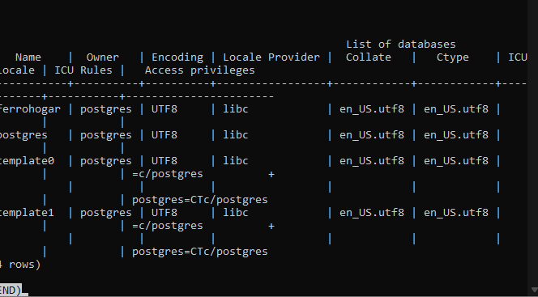

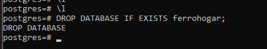

la eliminamos y con el mismo comando"\\l" confirmamos que ha sido borrada como se ve en la siguiente imagen

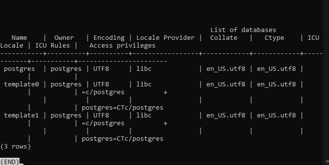

acto seguido creamos la base de datos

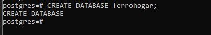

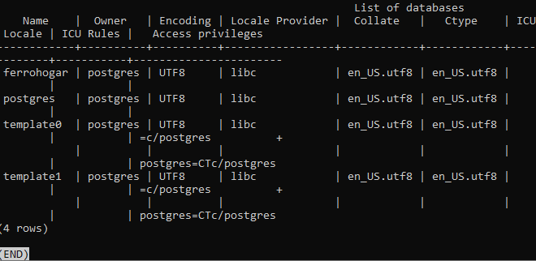

y usamos o nos conectamos a la base de datos

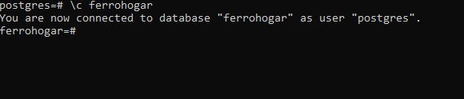

ya conectados, podremos crear cada una de las tablas de la base de datos

Creamos la tabla categories

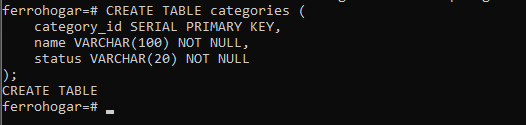

con el comando "\\d categories" mostramos la tablas

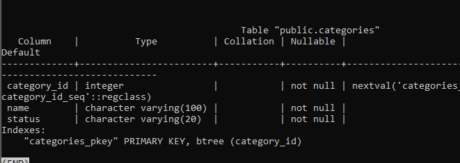

Creamos la tabla suppliers

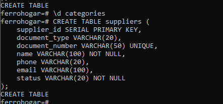

y la mostramos con "\\d suppliers"

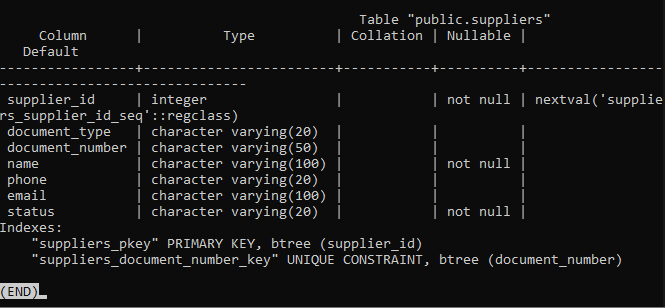

Creamos la tabla clients

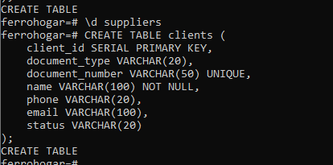

y la mostramos con "\\d clients"

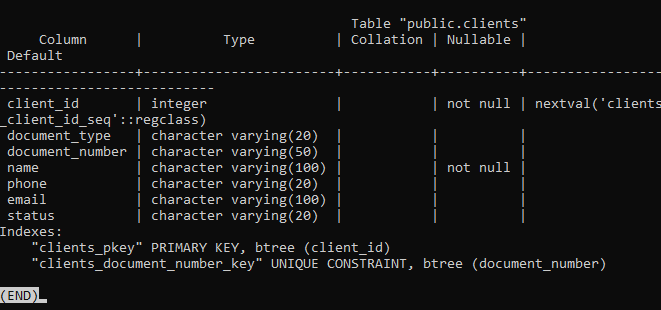

Creamos la tabla employees

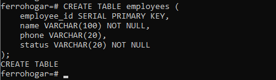

y la mostramos con "\\d employees"

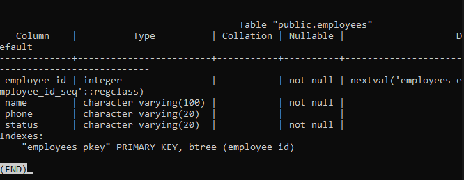

Creamos la tabla products

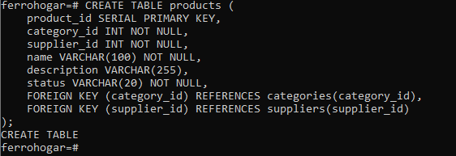

Y la mostramos con "\\d products"

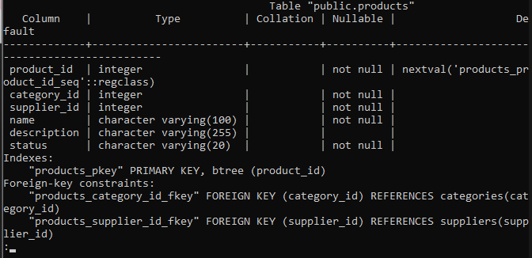

Creamos la tabla sales

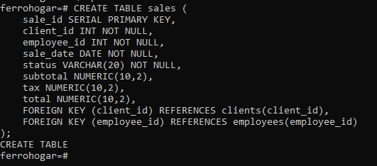

y la mostramos con "\\d sales"

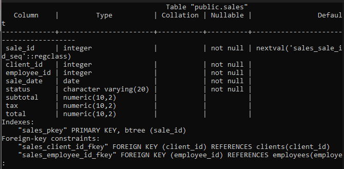

Creamos la tabla sales_details

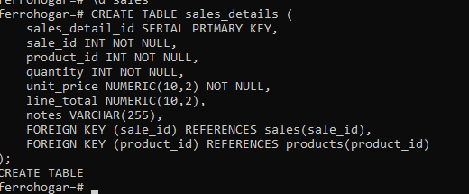

y la mostramos con "\\d sales_details"

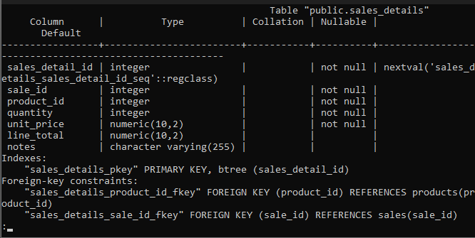
