# CRUD en Oracle - Procedimientos Almacenados

## Descripción General

Este documento documenta la creación de procedimientos CRUD (Create, Read, Update, Delete) para dos tablas en Oracle Database. Utilizaremos procedimientos almacenados para realizar operaciones de inserción, actualización y eliminación de datos.

---

## 1. Configuración Inicial

### Paso 1: Conectarse a la Base de Datos

Se abre una conexión SQL a la base de datos Oracle:


### Paso 2: Crear el Primer Script

Se ejecuta el script inicial para crear los procedimientos:

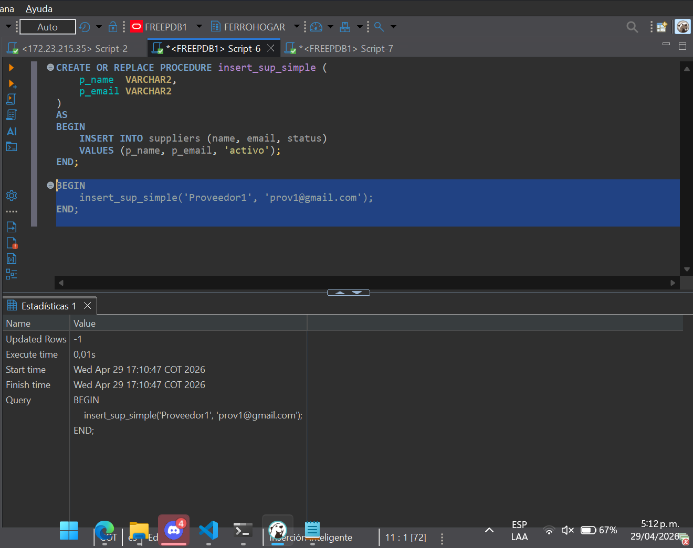

### Paso 3: Seleccionar Tabla de Referencia

Se utilizará la tabla **Suppliers** como la primera tabla de referencia para crear los procedimientos CRUD:

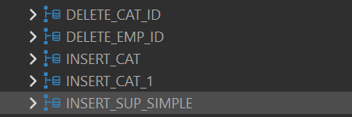

### Paso 4: Vista General del Proceso

Resumen visual del procedimiento completado:

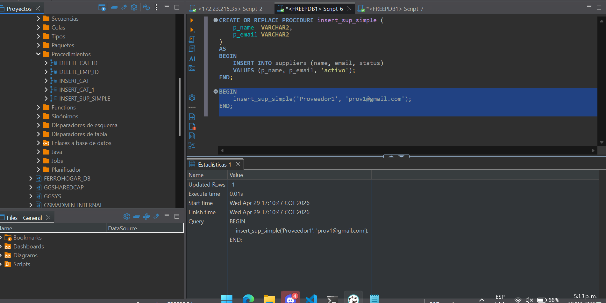

---

## 2. Procedimientos CREATE (INSERT)

### Ajuste Inicial de las Tablas

Se realiza un ajuste en las tablas para que el inicio de inserción comience desde el ID 51:

```sql
ALTER TABLE employees
```

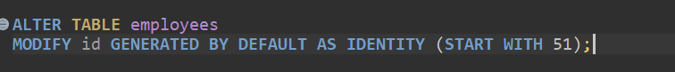

### 2.1 Procedimiento INSERT en Suppliers

Procedimiento para insertar registros en la tabla Suppliers:

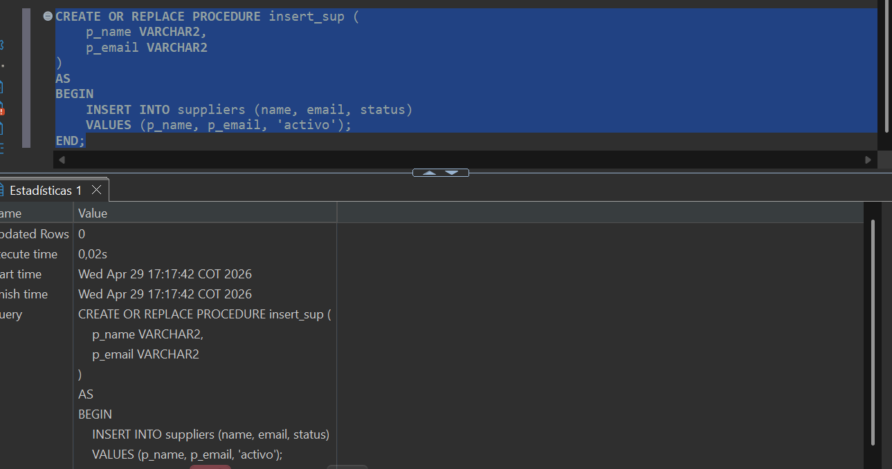

### 2.2 Procedimiento INSERT en Employees

Procedimiento para insertar registros en la tabla Employees:

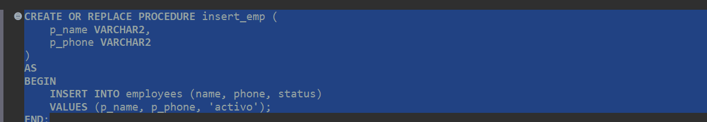

---

## 3. Procedimientos UPDATE (Actualización)

### 3.1 Procedimiento UPDATE en Suppliers

Procedimiento para actualizar registros en la tabla Suppliers:

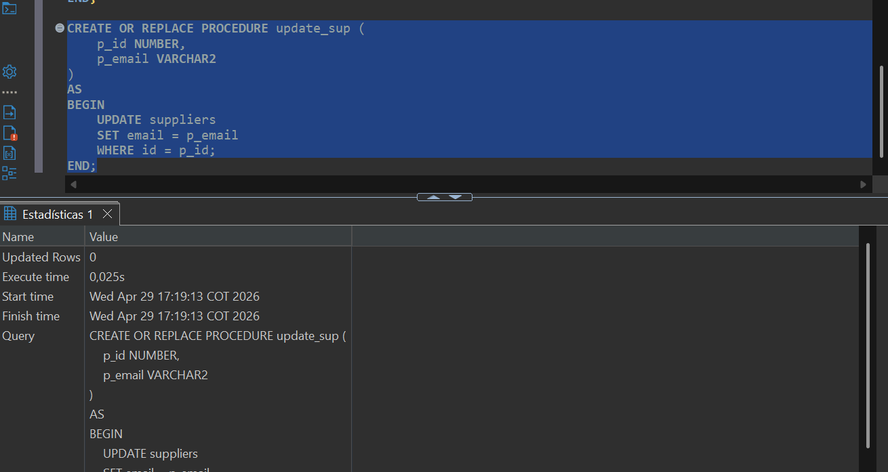

### 3.2 Procedimiento UPDATE en Employees

Procedimiento para actualizar registros en la tabla Employees:

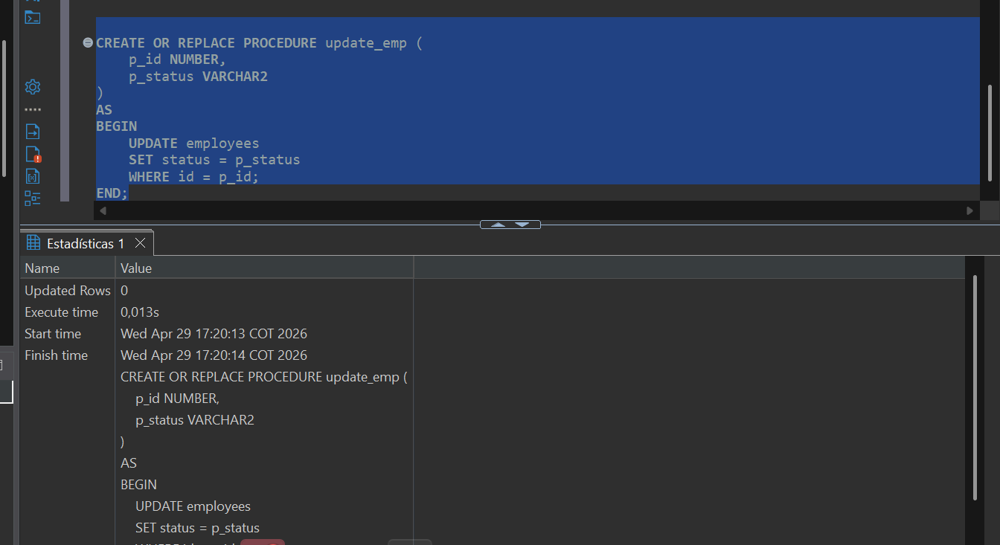

---

## 4. Procedimientos DELETE (Eliminación)

### 4.1 Procedimiento DELETE en Suppliers

Procedimiento para eliminar registros en la tabla Suppliers:

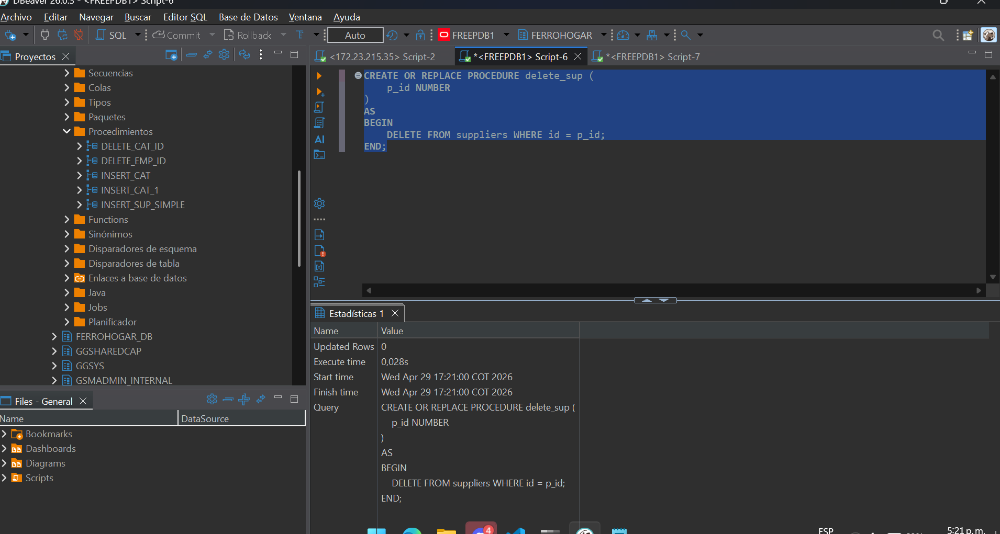

### 4.2 Procedimiento DELETE en Employees

Procedimiento para eliminar registros en la tabla Employees:

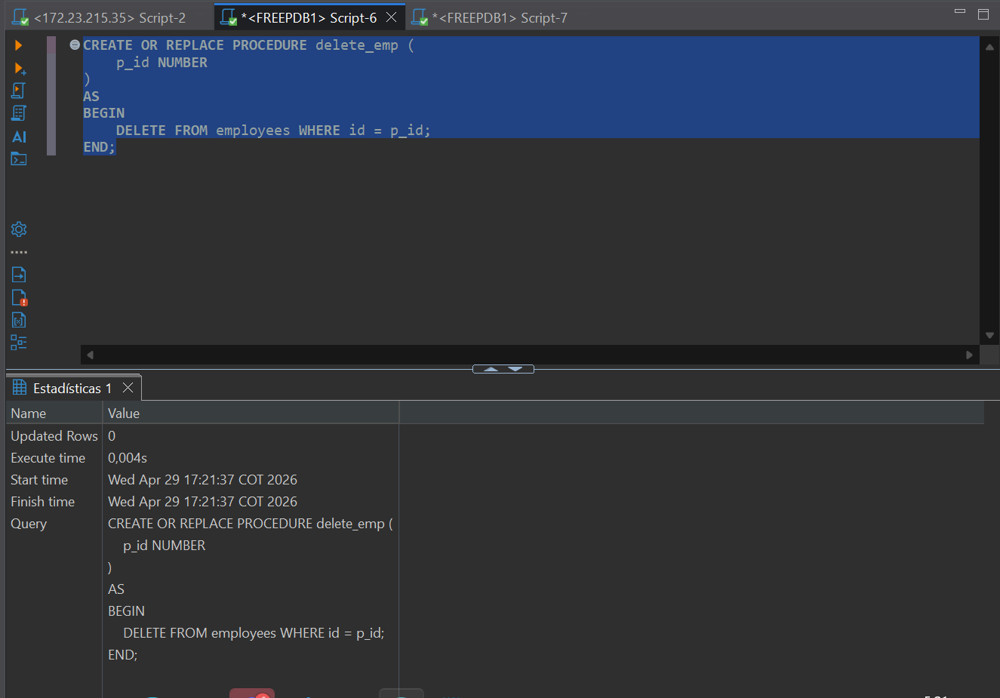

---

## 5. Ejecución de los Procedimientos

### Paso 1: Ejecutar Inserciones

Se ejecutan los procedimientos de inserción:

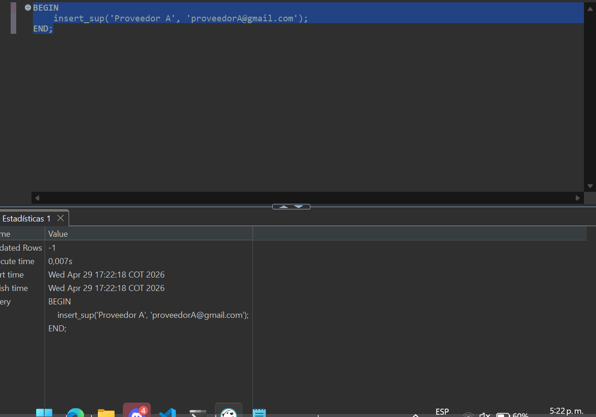

### ⚠️ Consideración Importante - Transacciones en Oracle

**En Oracle NO se guardan automáticamente los cambios.** Es necesario ejecutar un comando `COMMIT` al final de cada sesión de procedimientos para confirmar los cambios en la base de datos.

Ejecución de procedimientos con COMMIT:

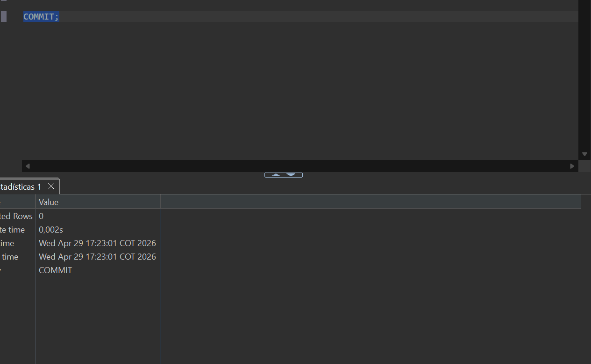

### Paso 2: Ejecutar Eliminaciones

Se ejecutan los procedimientos de eliminación:

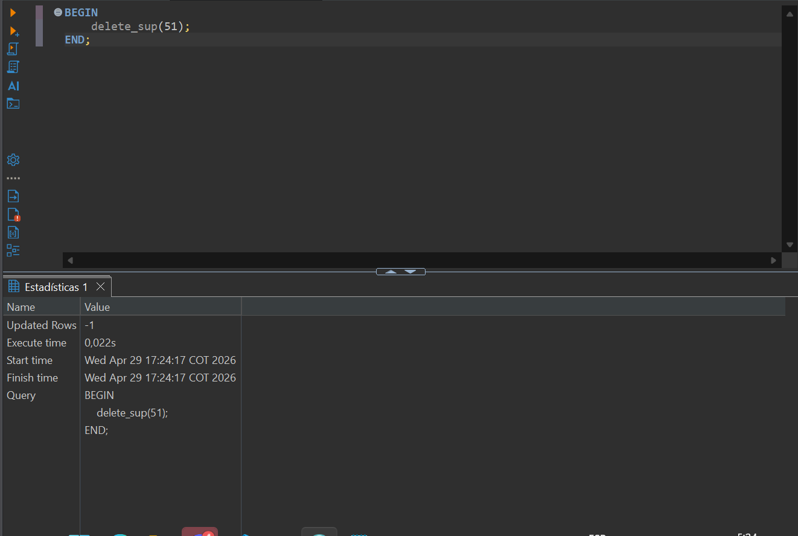
