### Condiciones en las Consultas o filtros en las Consultas

Para las condiciones se utiliza la clausula Where de la siguiente manera:

Quiero realizar la misma consulta anterior de cualquiera de las dos formas, teniendo en cuenta la condición que presente las ventas de una fecha especifica.

Forma 1:

``` {.script style="color: blue"}
create or replace view Buscarusuariosporfecha
as
SELECT C.name, C.email, V.* 
FROM clients as C, sales as V 
where C.id = V.id_clients and V.sale_date  = "2025-10-09"; 
```

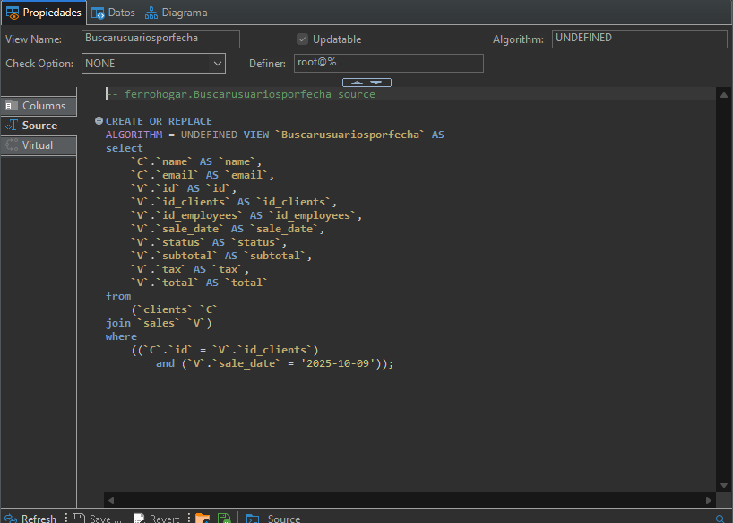

Nos da como resultado

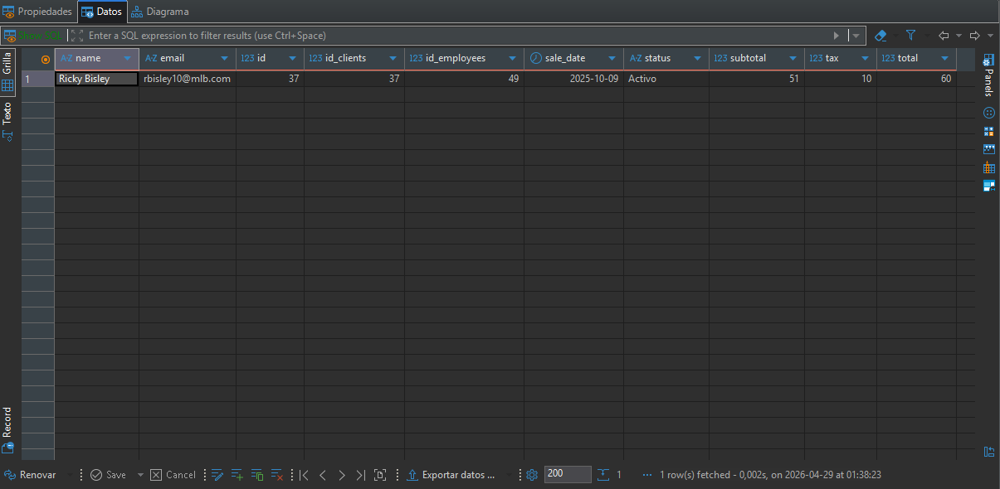

Forma 2:

``` {.script style="color: blue"}
    create or replace view Buscarusuariosporfecha2
    as
    SELECT C.name, C.email, V.* 
    FROM clients as C 
    join sales as V on(C.id = V.id_clients) 
    where  V.sale_date = "2025-09-29"; 
```

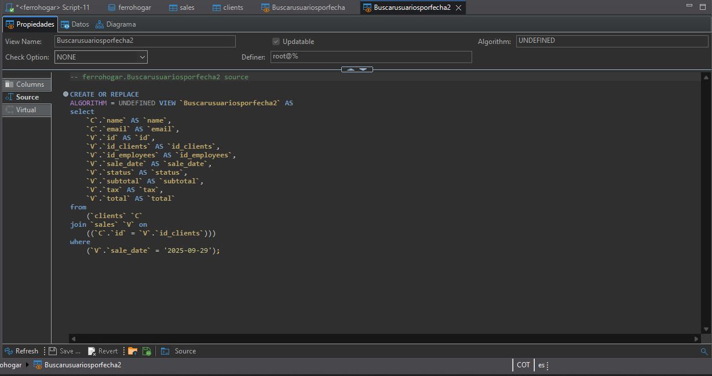

Nos da como resultado

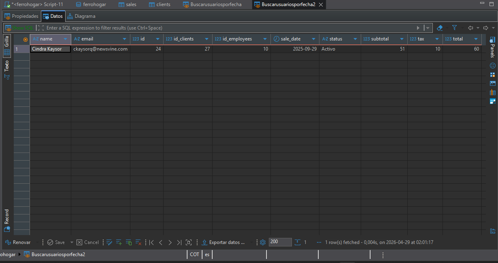

1.  Mostrar todo los correos de los clientes que comiencen con la letra m.

``` {.script style="color: blue"}
    create or replace view Filtrar_correo_M
    as
select * 
from clients as C 
where C.email like 'm%';
```

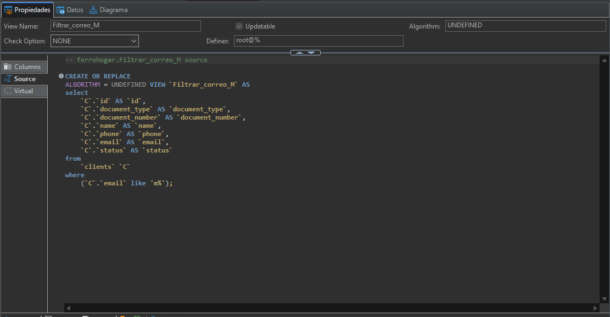

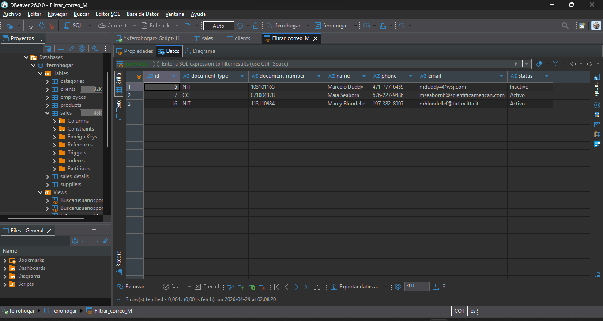

1.  Mostrar todos los correos de los clientes que contengan el dominio gmail

    ```         
        create or replace view Filtrar_dominio_gmail
        as
    SELECT * 
    FROM clients as C 
    where C.email like concat('%','gmail','%'); 
    ```

    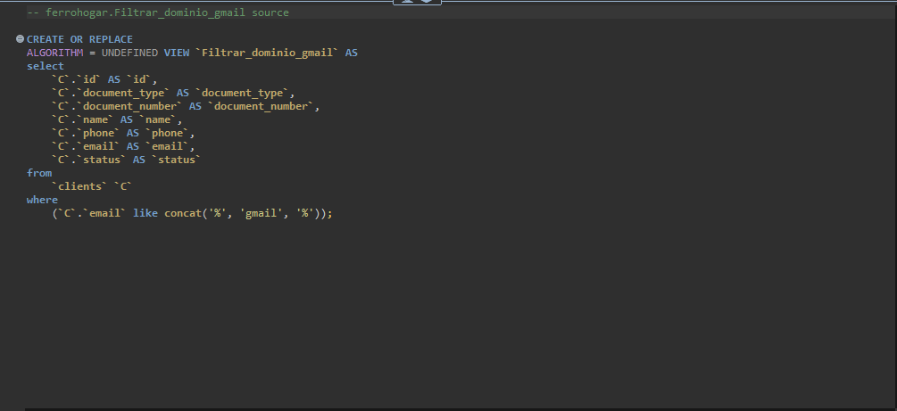nos da como resultado

    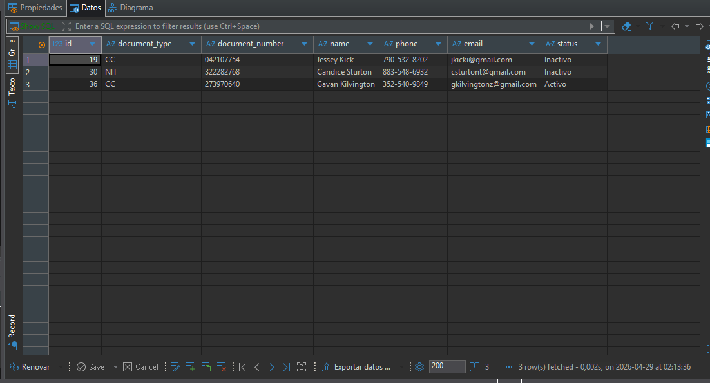

Mostrar todas las ventas en un rango de fecha, incluyendo sus respectivos clientes y productos. Ordenarla ascendentemente por fecha

Forma 1:

```         
    create or replace view Filtrar_rango_fecha
    as
    
select C.name as nombre,C.status as estado, V.sale_date as fecha,
PV.quantity as cantidad, P.name as producto 
from clients as C, sales as V, sales_details as PV, products as P 
where C.id = V.id_clients and 
V.id = PV.id_sales and 
P.id = PV.id_products and 
V.sale_date between "2025-09-14" and "2026-02-20" 
order by V.sale_date asc; 
```

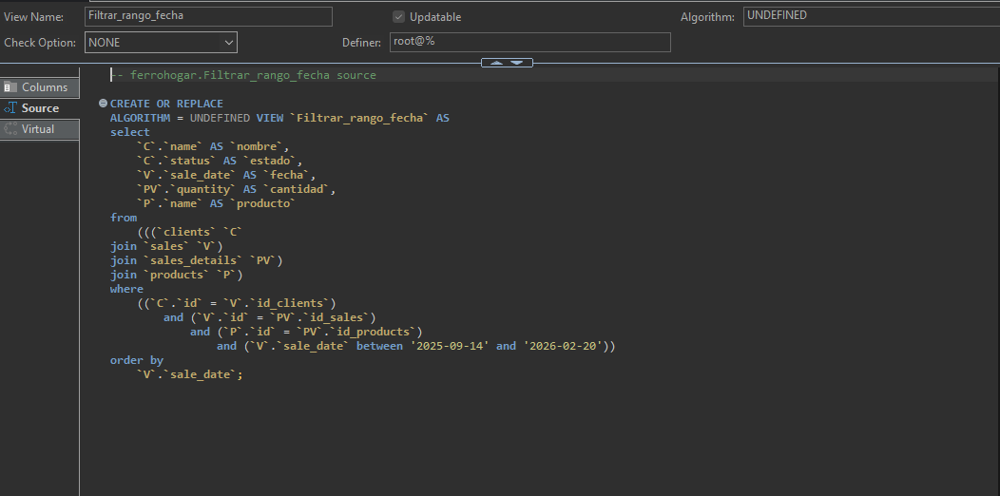

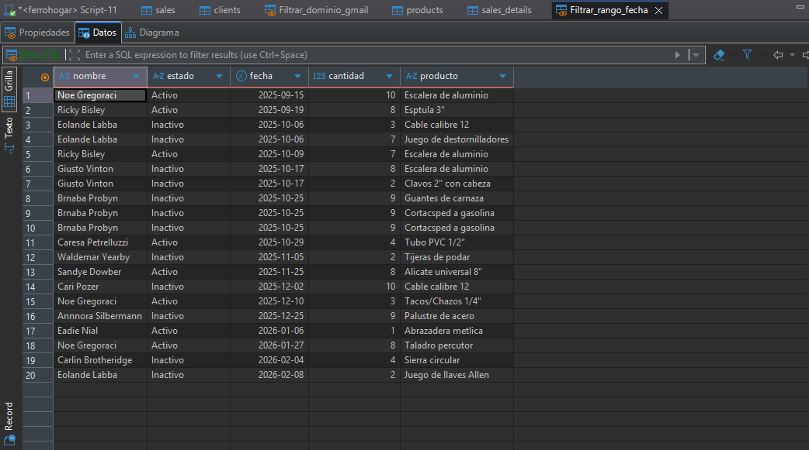

Forma 2:

```         
    create or replace view Filtrar_rango_fecha2
    as
    
select C.name as nombre, C.status as estado, V.sale_date as fecha,
PV.quantity as cantidad, P.name as producto
from clients as C 
join sales as V on (C.id = V.id_clients) 
join sales_details as PV on (V.id = PV.id_sales) 
join products as P on (P.id = PV.id_products) 
where  V.sale_date between "2025-09-01" and "2026-03-15" 
order by V.sale_date asc; 
```

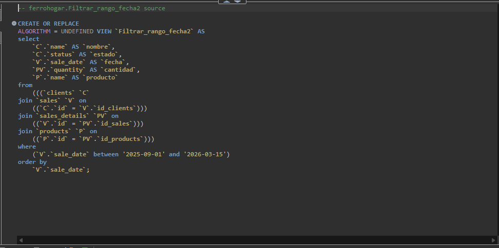

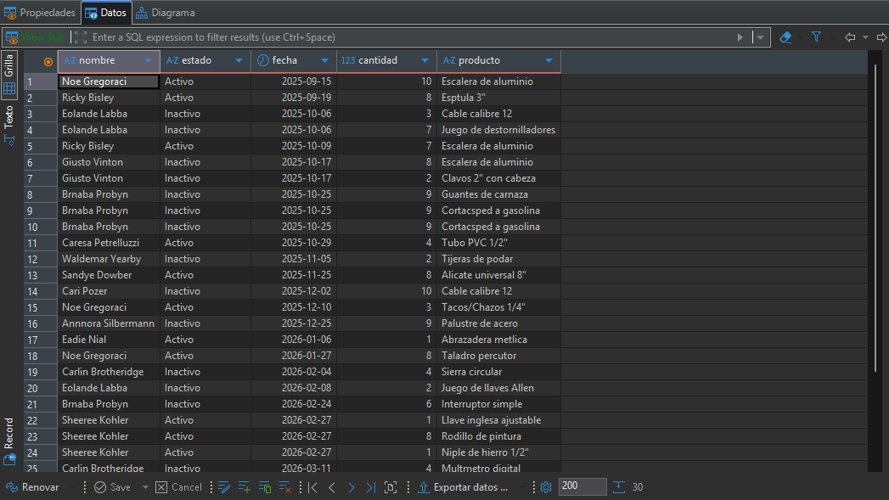

### Consultas de Agrupamiento

Se consideran este tipo de consultas cuando tenemos valores que se repiten en los registros.

Si observamos la siguiente consulta:

```         
create or replace view agrupamiento
as

SELECT C.name, C.email, V.* 
FROM sales as V 
join clients as C on( C.id = V.id_clients );
```

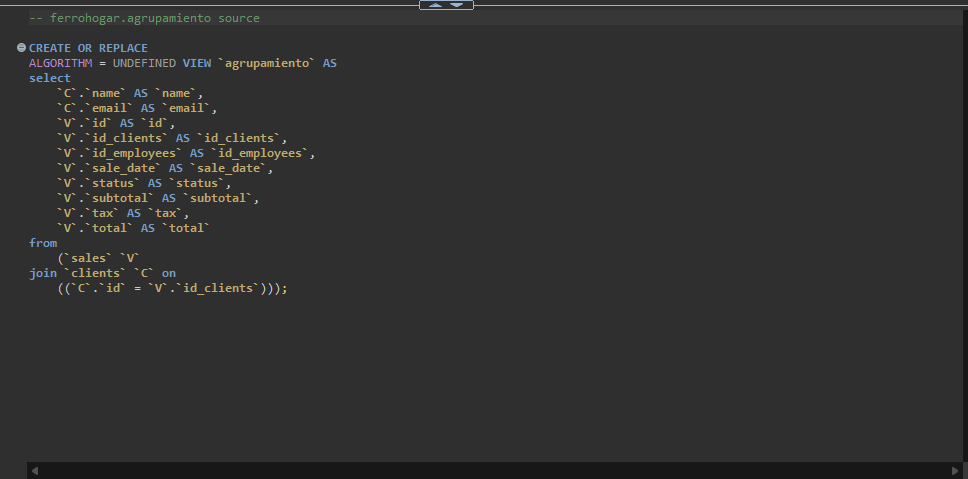

da como resultado

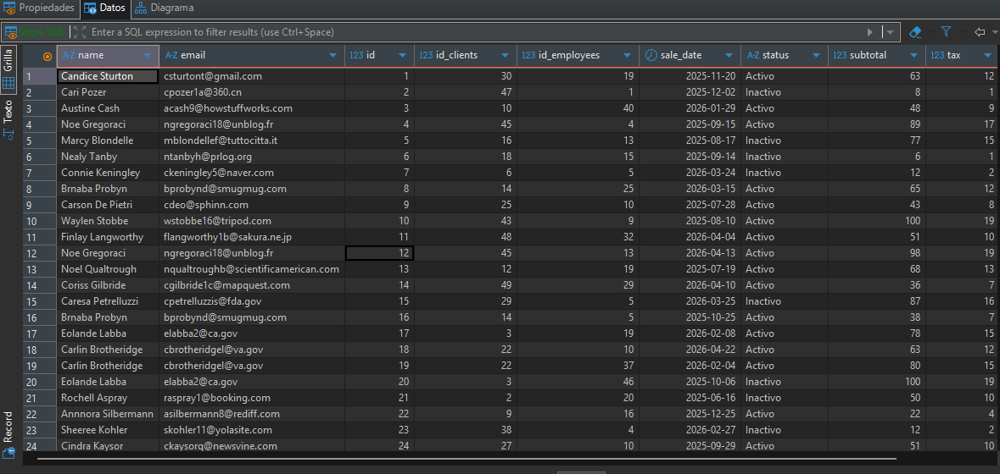

Forma 1:

``` {.script style="color: blue"}
create or replace view agrupamiento_clientesid
as

SELECT C.id, C.name, sum(V.total) as TotalSuma, count(V.id_clients) as CuentaTotal, avg(V.total) as Promedio  
FROM clients as C, sales as V  
where  C.id = V.id_clients and 
V.sale_date between "2025-03-01" and "2026-03-30" 
group by C.id 
order by TotalSuma desc; 
```

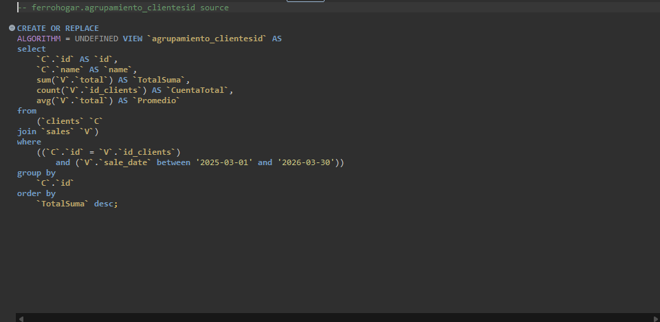Junta todas las ventas de cada cliente en un solo resultado

el resultado que nos da es el siguiente

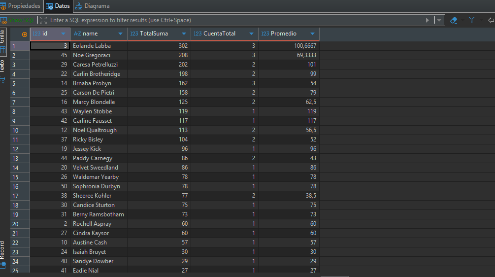

Forma 2:

``` {.script style="color: blue"}
create or replace view agrupamiento_clientesid2
as

SELECT C.id, C.name, sum(V.total) as TotalSuma, count(V.id_clients) as CuentaTotal, avg(V.total) as Promedio  
FROM clients as C 
join sales as V on( C.id = V.id_clients ) 
where V.sale_date between "2025-03-01" and "2026-03-30" 
group by C.id 
order by TotalSuma desc; 
```

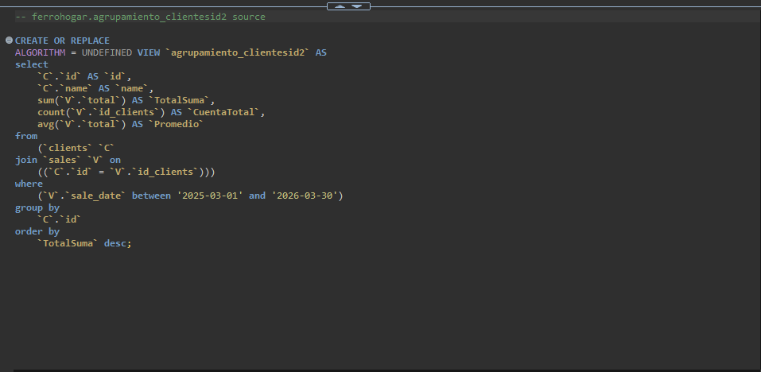

como resultado nos da

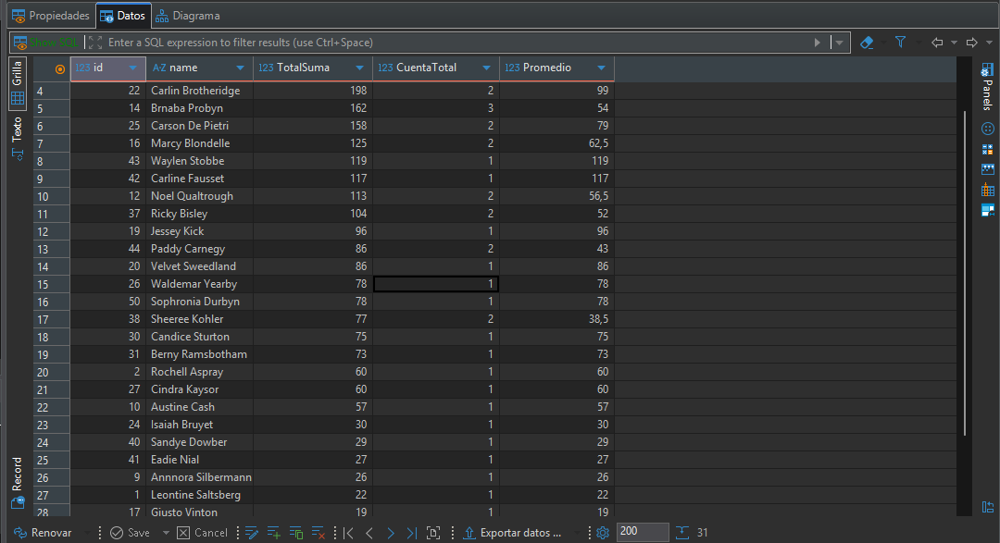

También se le pueden colocar condiciones a las consultas agrupadas. Para este caso utilice la clausula Having., e la siguiente manera:

Forma 1:

``` {.script style="color: blue"}
create or replace view agrupamiento_clientesid_having
as


SELECT C.id, C.name, sum(V.total) as TotalSuma, count(V.id_clients) as CuentaTotal, avg(V.total) as Promedio  
FROM clients as C, sales as V  
where  C.id = V.id_clients and 
V.sale_date between "2025-03-01" and "2026-03-30" 
group by C.id 
having CuentaTotal >=2
order by TotalSuma desc; 
```

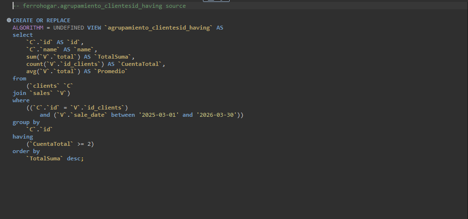

Nos da como resultado

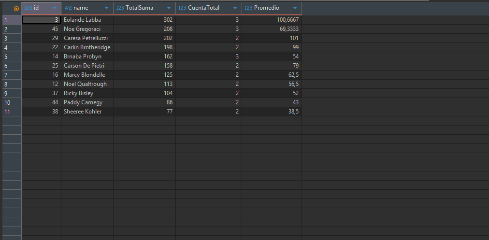

Forma 2:

``` {.script style="color: blue"}
create or replace view agrupamiento_clientesid_having2
as


SELECT C.id, C.name, sum(V.total) as TotalSuma, count(V.id_clients) as CuentaTotal, avg(V.total) as Promedio  
FROM clients as C 
join sales as V on( C.id = V.id_clients ) 
where V.sale_date between "2025-03-01" and "2026-03-30" 
group by C.id 
having CuentaTotal >=2
order by TotalSuma desc;
```

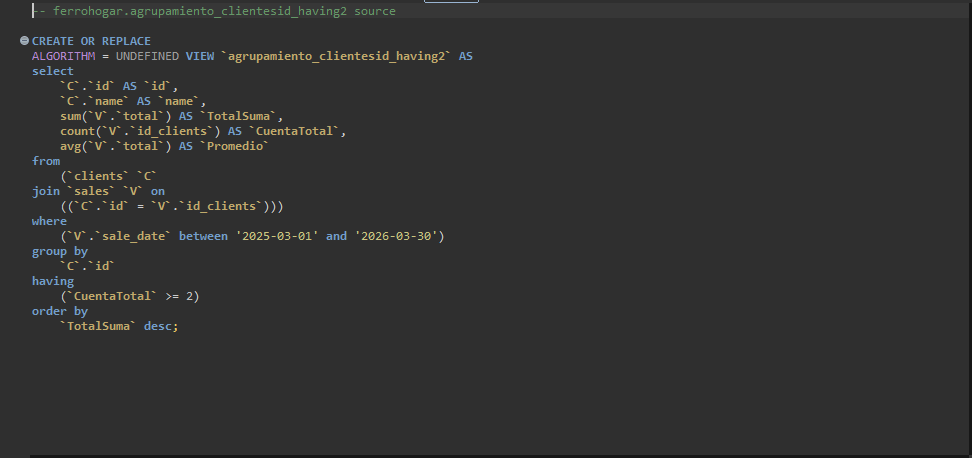

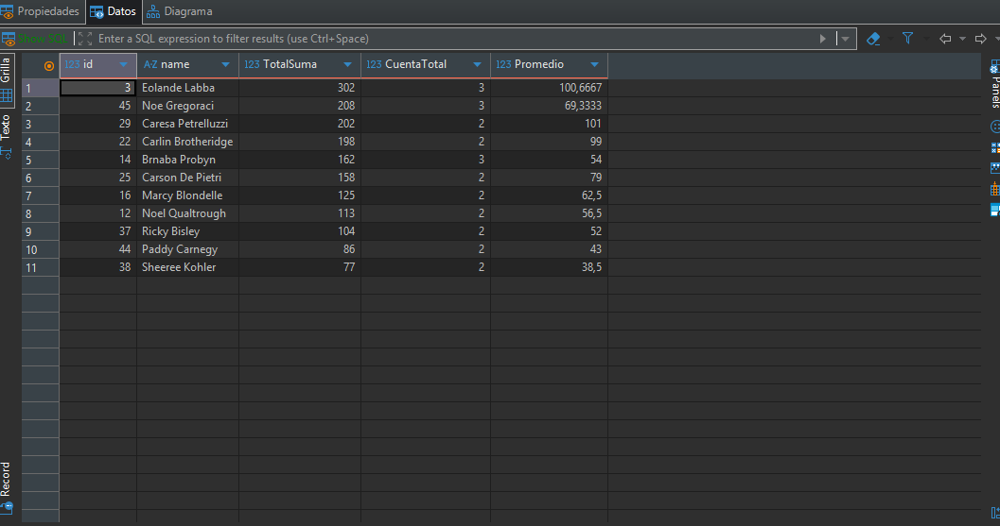

Lo que hace el havinf aqui, es filtrarlo de forma limitante teniendo en cuenta la columna cuenta total, solo mostrando solo los numero mayores o igual a 2
