### Condiciones en las Consultas o filtros en las Consultas

Para las condiciones se utiliza la clausula Where de la siguiente manera:

Quiero realizar la misma consulta anterior de cualquiera de las dos formas, teniendo en cuenta la condición que presente las ventas de una fecha especifica.

Forma 1:

``` {.script style="color: blue"}
CREATE OR REPLACE VIEW Buscarusuariosporfecha AS
SELECT C.name, C.email, V.*
FROM clients C
JOIN sales V ON C.id = V.id_clients
WHERE V.sale_date = DATE '2025-10-09';
```

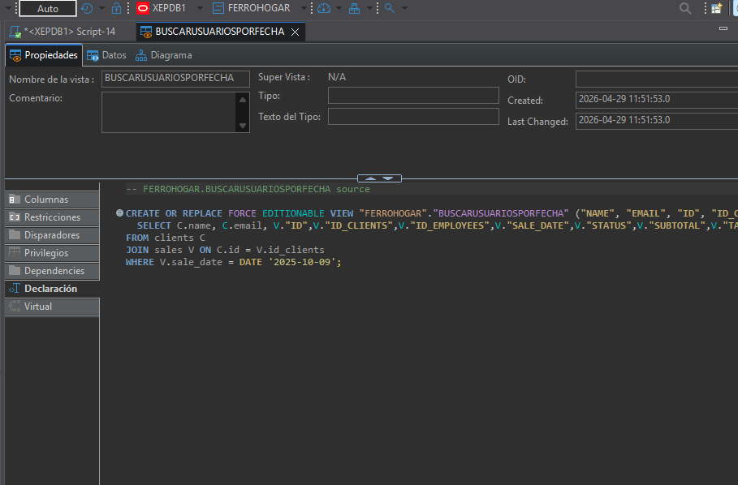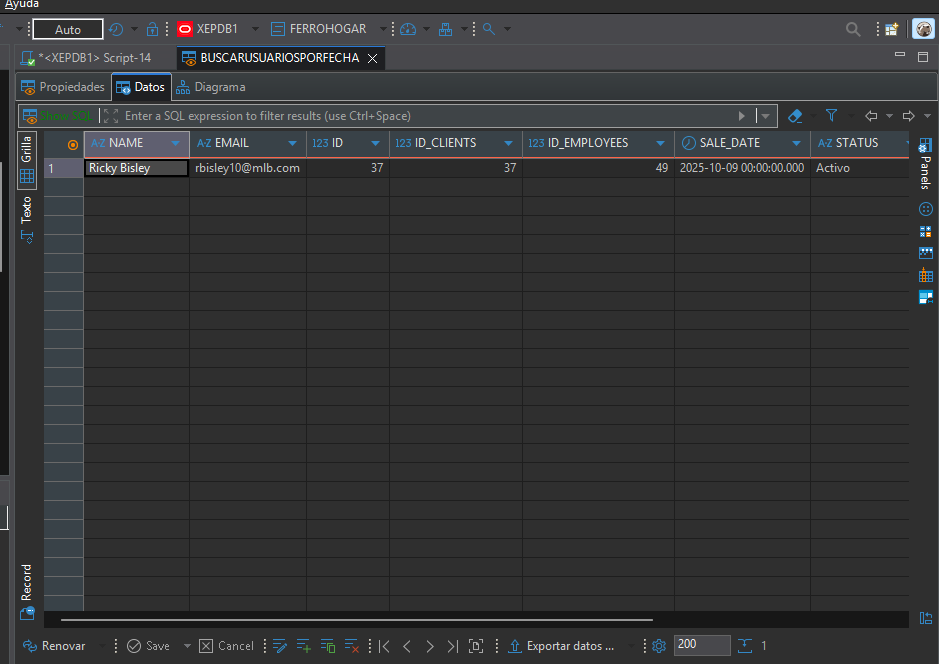Forma 2:

```         
CREATE OR REPLACE VIEW Buscarusuariosporfecha2 AS
SELECT C.name, C.email, V.*
FROM clients C
JOIN sales V ON C.id = V.id_clients
WHERE V.sale_date = DATE '2025-09-29';
```

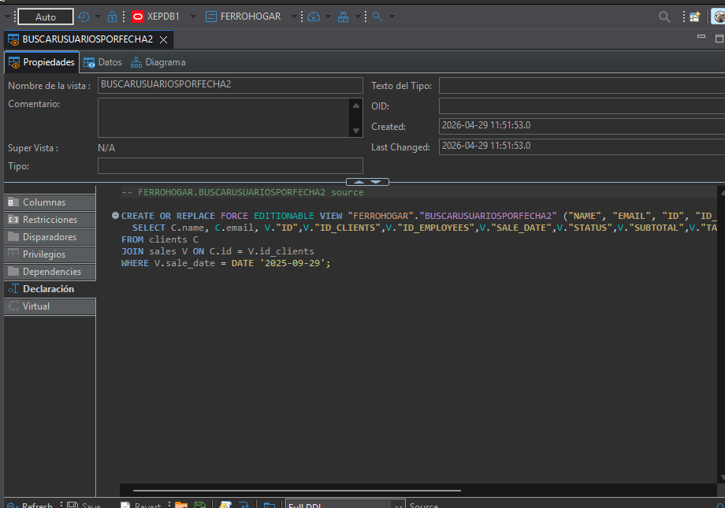

1.  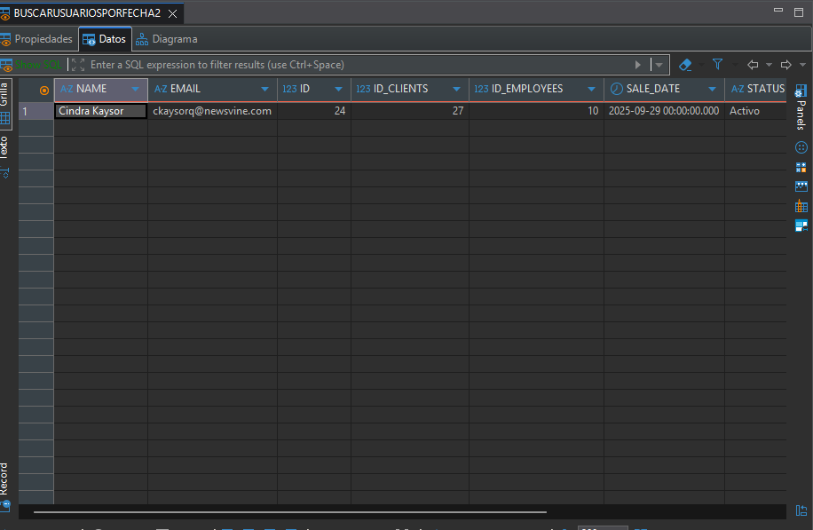Mostrar todo los correos de los clientes que comiencen con la letra m.

``` {.script style="color: blue"}
CREATE OR REPLACE VIEW Filtrar_correo_M AS
SELECT *
FROM clients C
WHERE C.email LIKE 'm%';
```

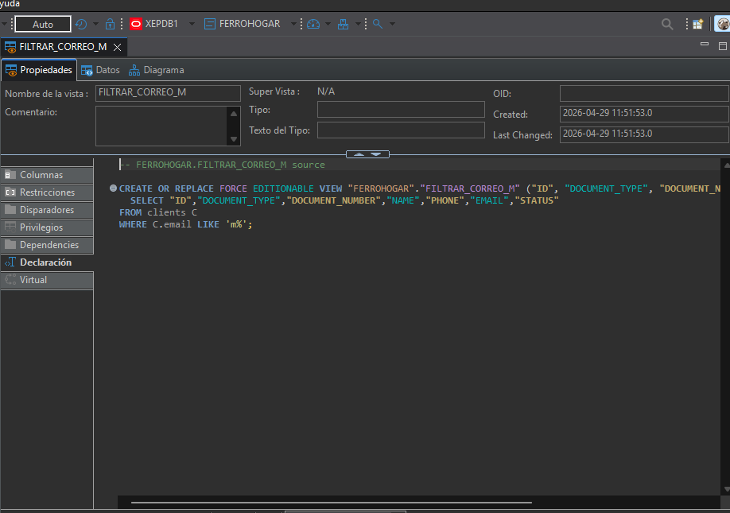

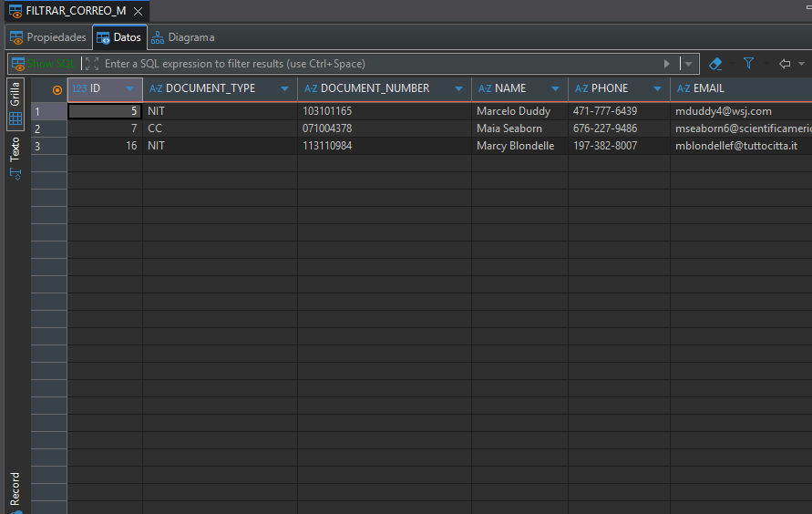

-   Mostrar todos los correos de los clientes que contengan el dominio gmail

    ```         
    CREATE OR REPLACE VIEW Filtrar_dominio_gmail AS
    SELECT *
    FROM clients C
    WHERE C.email LIKE '%' || 'gmail' || '%';
    ```

    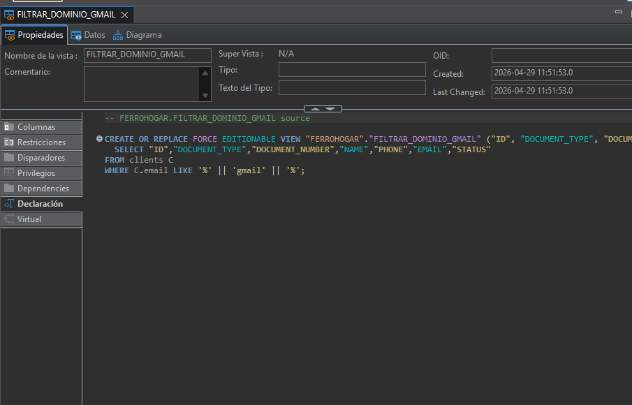

-   Nos da el siguiente resultado


Mostrar todas las ventas en un rango de fecha, incluyendo sus respectivos clientes y productos. Ordenarla ascendentemente por fecha

Forma 1:

```         
CREATE OR REPLACE VIEW Filtrar_rango_fecha AS
SELECT 
    C.name AS nombre,
    C.status AS estado,
    V.sale_date AS fecha,
    PV.quantity AS cantidad,
    P.name AS producto
FROM clients C
JOIN sales V ON C.id = V.id_clients
JOIN sales_details PV ON V.id = PV.id_sales
JOIN products P ON P.id = PV.id_products
WHERE V.sale_date BETWEEN DATE '2025-09-14' AND DATE '2026-02-20';
```

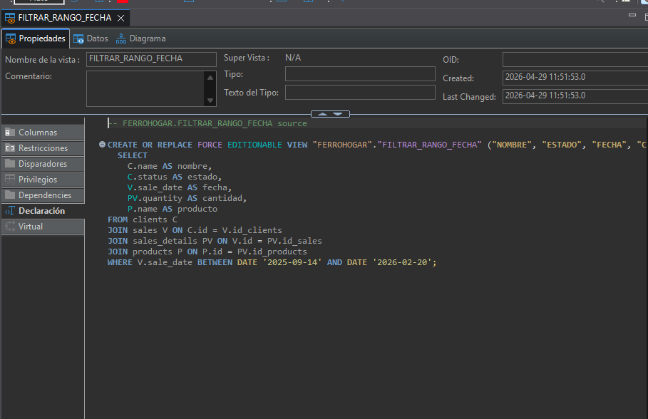

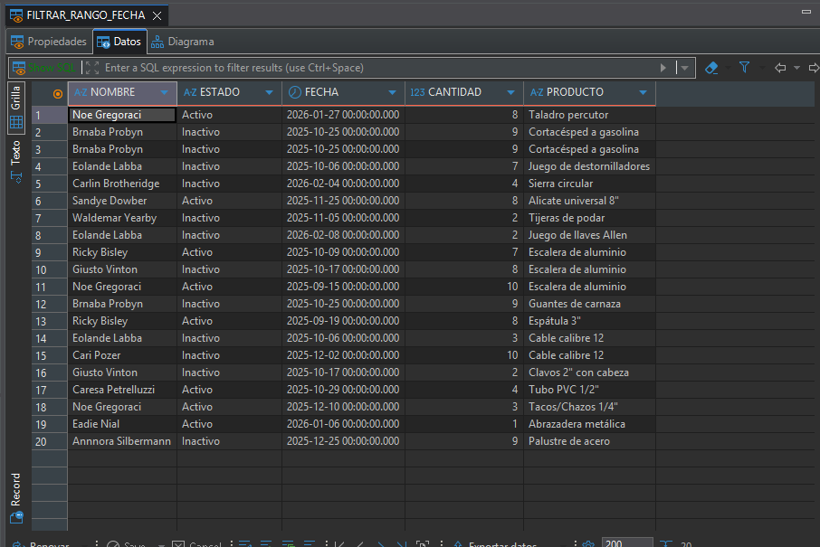Forma 2: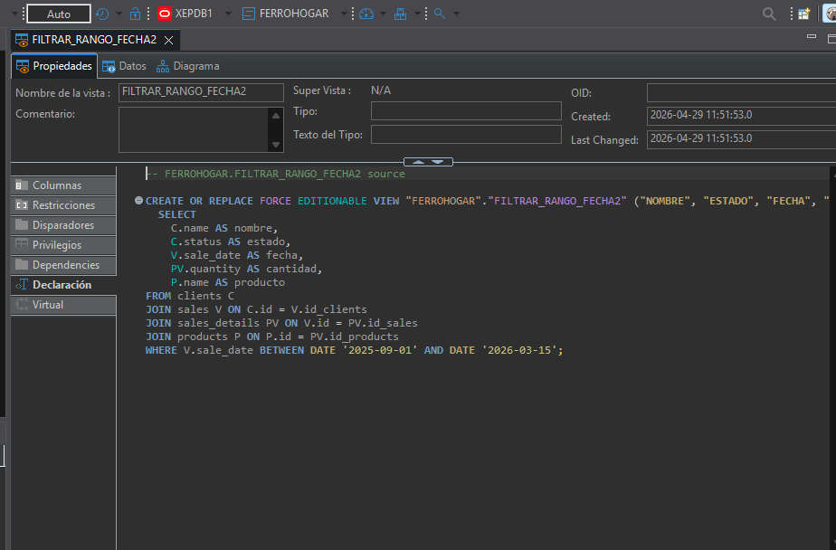

Dandonos como resultado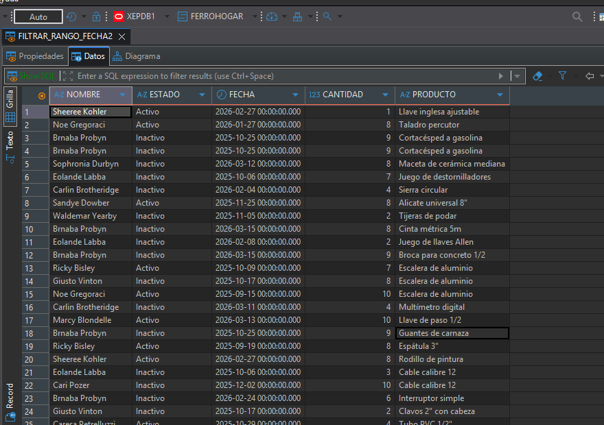

### Consultas de Agrupamiento

Se consideran este tipo de consultas cuando tenemos valores que se repiten en los registros.

Si observamos la siguiente consulta:

```         
CREATE OR REPLACE VIEW agrupamiento AS
SELECT C.name, C.email, V.*
FROM sales V
JOIN clients C ON C.id = V.id_clients;
```

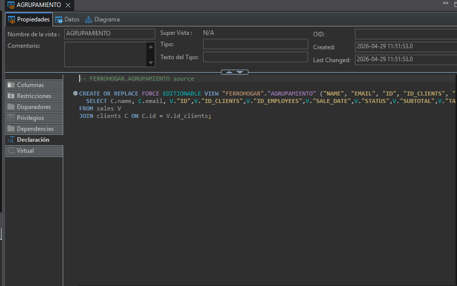

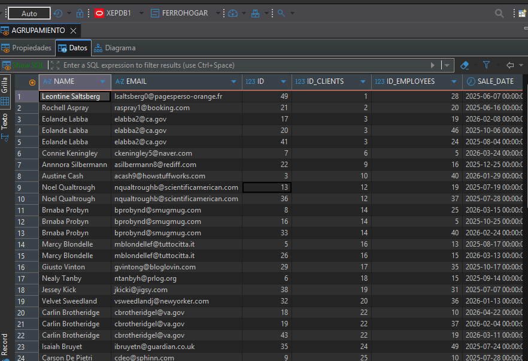su resultado es

Forma: 1

``` {.script style="color: blue"}
CREATE OR REPLACE VIEW agrupamiento_clientesid AS
SELECT 
    C.id,
    C.name,
    SUM(V.total) AS TotalSuma,
    COUNT(V.id_clients) AS CuentaTotal,
    AVG(V.total) AS Promedio
FROM clients C
JOIN sales V ON C.id = V.id_clients
WHERE V.sale_date BETWEEN DATE '2025-03-01' AND DATE '2026-03-30'
GROUP BY C.id, C.name;
```

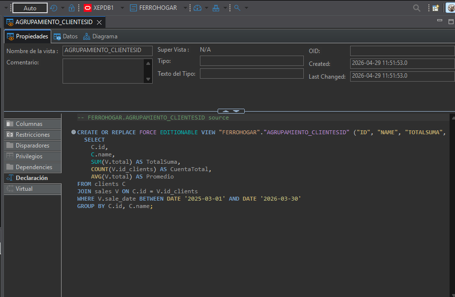su resultado es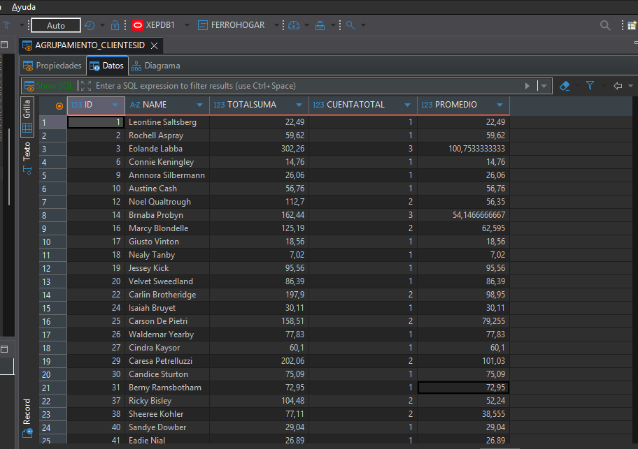

Forma 2:

``` {.script style="color: blue"}
CREATE OR REPLACE VIEW agrupamiento_clientesid2 AS
SELECT 
    C.id,
    C.name,
    SUM(V.total) AS TotalSuma,
    COUNT(V.id_clients) AS CuentaTotal,
    AVG(V.total) AS Promedio
FROM clients C
JOIN sales V ON C.id = V.id_clients
WHERE V.sale_date BETWEEN DATE '2025-03-01' AND DATE '2026-03-30'
GROUP BY C.id, C.name;
```

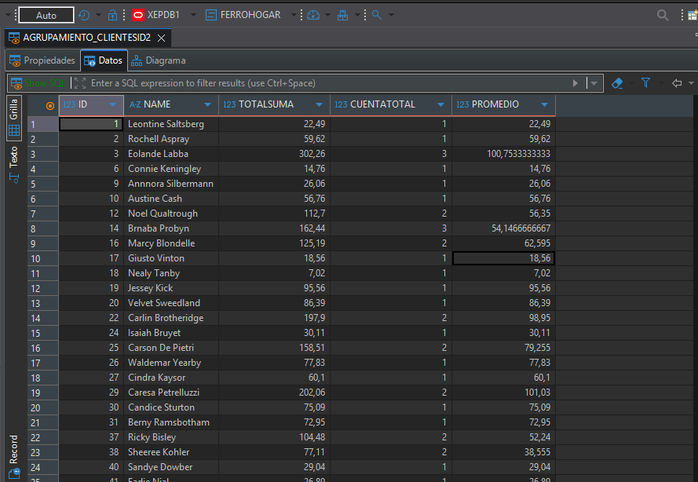](images/clipboard-2656779900.png)

También se le pueden colocar condiciones a las consultas agrupadas. Para este caso utilice la clausula Having., e la siguiente manera:

Forma 1:

``` {.script style="color: blue"}
CREATE OR REPLACE VIEW agrupamiento_clientesid_having AS
SELECT 
    C.id,
    C.name,
    SUM(V.total) AS TotalSuma,
    COUNT(V.id_clients) AS CuentaTotal,
    AVG(V.total) AS Promedio
FROM clients C
JOIN sales V ON C.id = V.id_clients
WHERE V.sale_date BETWEEN DATE '2025-03-01' AND DATE '2026-03-30'
GROUP BY C.id, C.name
HAVING COUNT(V.id_clients) >= 2;
```

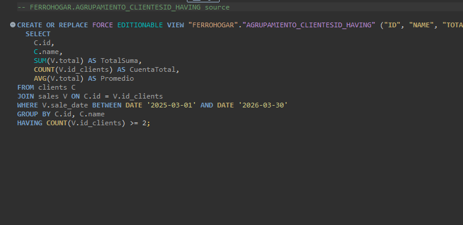teniendo como resultado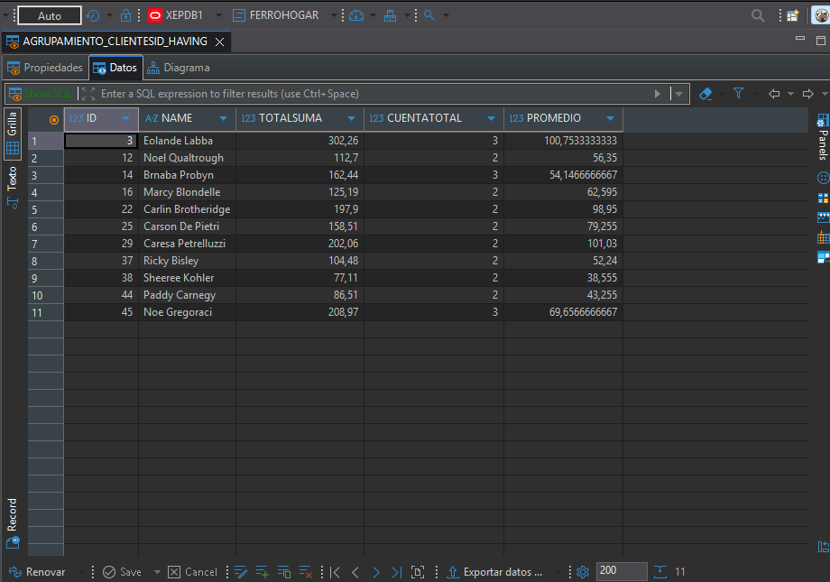

Forma 2:

``` {.script style="color: blue"}
CREATE OR REPLACE VIEW agrupamiento_clientesid_having2 AS
SELECT 
    C.id,
    C.name,
    SUM(V.total) AS TotalSuma,
    COUNT(V.id_clients) AS CuentaTotal,
    AVG(V.total) AS Promedio
FROM clients C
JOIN sales V ON C.id = V.id_clients
WHERE V.sale_date BETWEEN DATE '2025-03-01' AND DATE '2026-03-30'
GROUP BY C.id, C.name
HAVING COUNT(V.id_clients) >= 2;
```

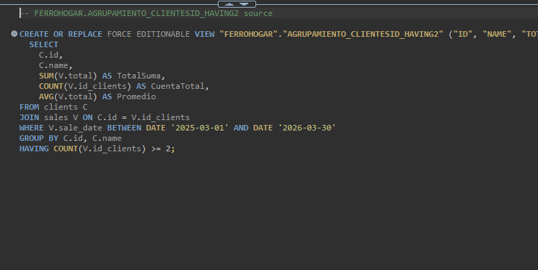

y su resultado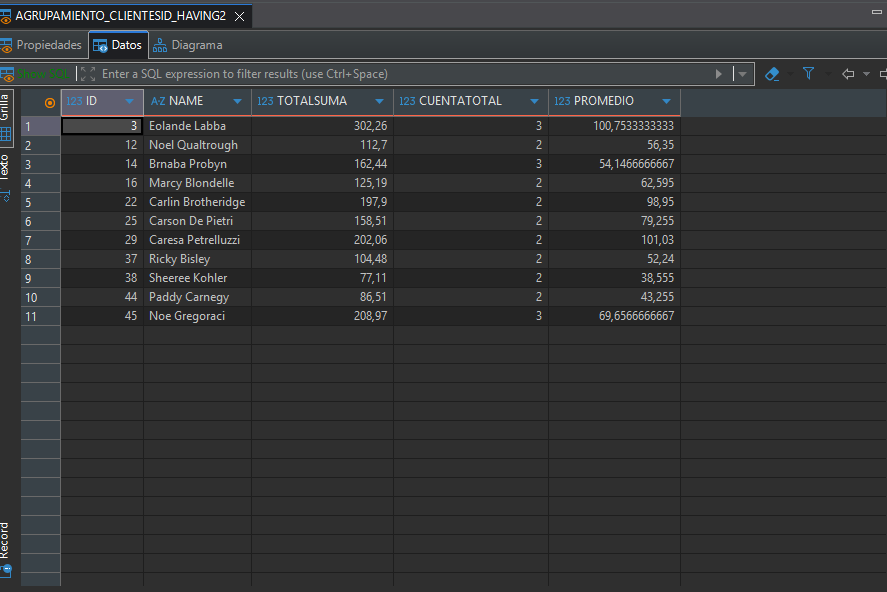
