### Condiciones en las Consultas o filtros en las Consultas

Para las condiciones se utiliza la clausula Where de la siguiente manera:

Quiero realizar la misma consulta anterior de cualquiera de las dos formas, teniendo en cuenta la condición que presente las ventas de una fecha especifica.

Forma 1:

``` {.script style="color: blue"}
    create or replace view Buscarusuariosporfecha
as
SELECT C.name, C.email, V.* 
FROM clients as C, sales as V 
where C.id = V.id_clients and V.sale_date  = '2025-10-09'; 
```

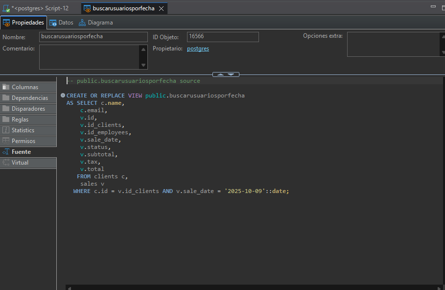

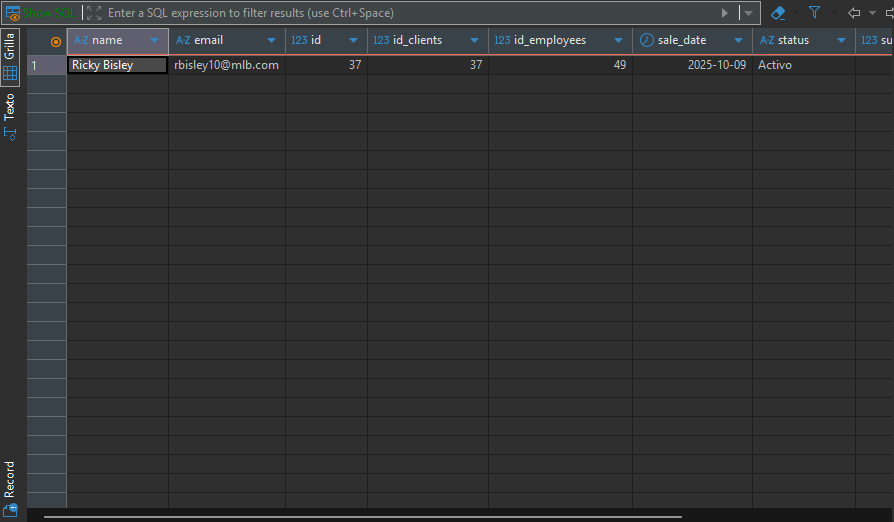

Forma 2:

```         
create or replace view Buscarusuariosporfecha2
    as
    SELECT C.name, C.email, V.* 
    FROM clients as C 
    join sales as V on(C.id = V.id_clients) 
    where  V.sale_date = '2025-09-29'; 
```

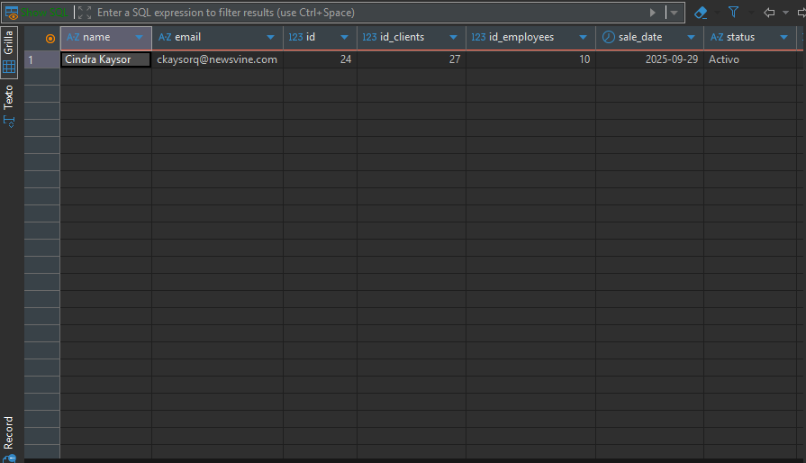](images/clipboard-2570376807.png)

1.  Mostrar todo los correos de los clientes que comiencen con la letra m.

``` {.script style="color: blue"}
    create or replace view Filtrar_correo_M     as select *  from clients as C  where C.email like 'm%';
```


-   Mostrar todos los correos de los clientes que contengan el dominio gmail

    ```         
        create or replace view Filtrar_dominio_gmail
        as
    SELECT * 
    FROM clients as C 
    where C.email like concat('%','gmail','%'); 
    ```

    

-   Nos da el siguiente resultado


Mostrar todas las ventas en un rango de fecha, incluyendo sus respectivos clientes y productos. Ordenarla ascendentemente por fecha

Forma 1:

```         
create or replace view Filtrar_rango_fecha
as

select C.name as nombre,C.status as estado, V.sale_date as fecha,
PV.quantity as cantidad, P.name as producto 
from clients as C, sales as V, sales_details as PV, products as P 
where C.id = V.id_clients and 
V.id = PV.id_sales and 
P.id = PV.id_products and 
V.sale_date between '2025-09-14' and '2026-02-20' 
order by V.sale_date asc; 
```

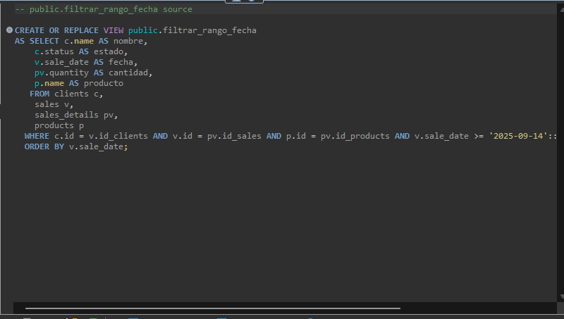

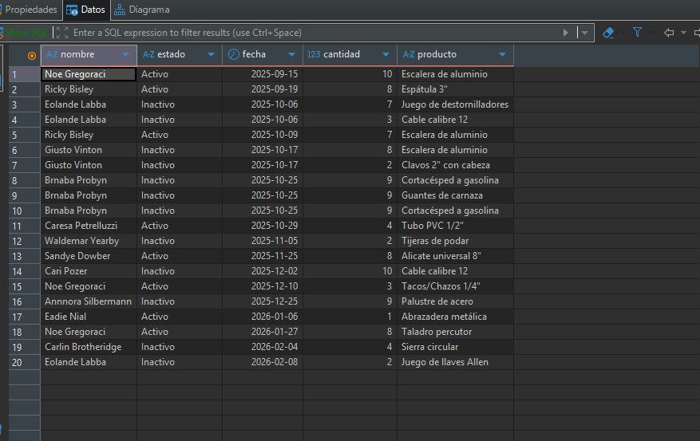

Forma 2:


Dandonos como resultado


### Consultas de Agrupamiento

Se consideran este tipo de consultas cuando tenemos valores que se repiten en los registros.

Si observamos la siguiente consulta:

```         
create or replace view agrupamiento
as

SELECT C.name, C.email, V.* 
FROM sales as V 
join clients as C on( C.id = V.id_clients );
```

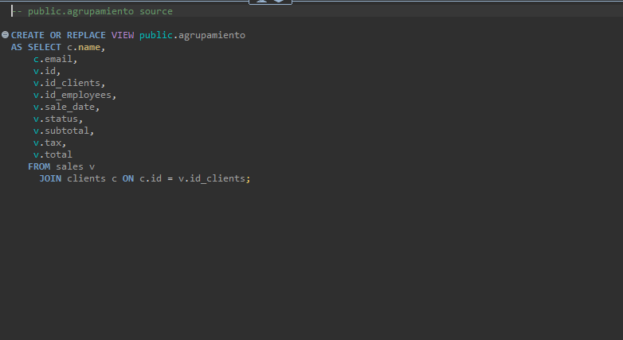

su resultado es

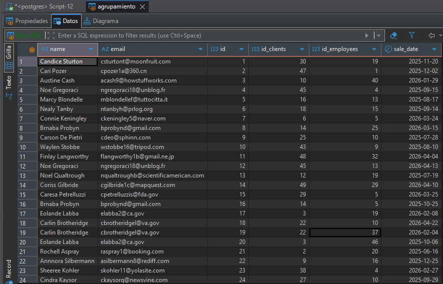

Forma: 1

``` {.script style="color: blue"}
create or replace view agrupamiento_clientesid
as

SELECT C.id, C.name, sum(V.total) as TotalSuma, count(V.id_clients) as CuentaTotal, avg(V.total) as Promedio  
FROM clients as C, sales as V  
where  C.id = V.id_clients and 
V.sale_date between '2025-03-01' and '2026-03-30' 
group by C.id 
order by TotalSuma desc; 
```

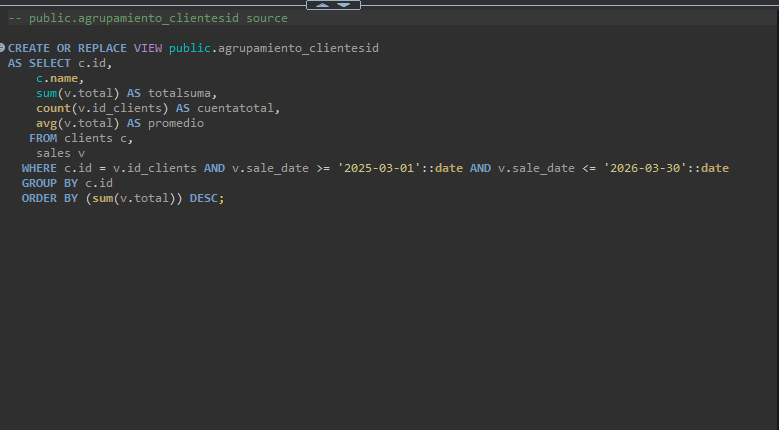

su resultado es\
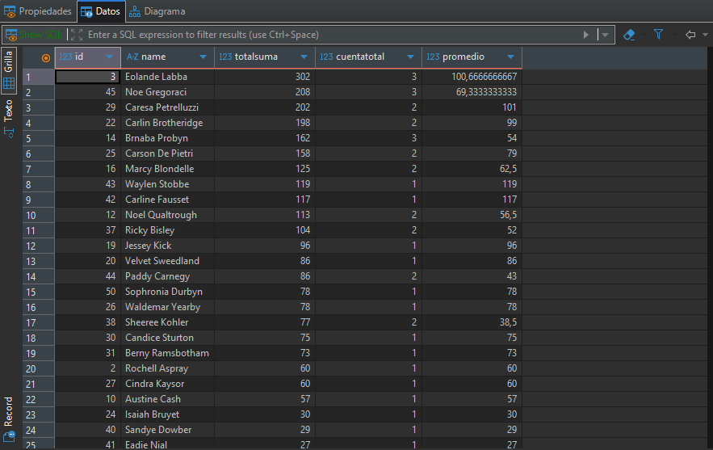

Forma 2:

``` {.script style="color: blue"}
create or replace view agrupamiento_clientesid2
as

SELECT C.id, C.name, sum(V.total) as TotalSuma, count(V.id_clients) as CuentaTotal, avg(V.total) as Promedio  
FROM clients as C 
join sales as V on( C.id = V.id_clients ) 
where V.sale_date between '2025-03-01' and '2026-03-30'
group by C.id 
order by TotalSuma desc; 
```

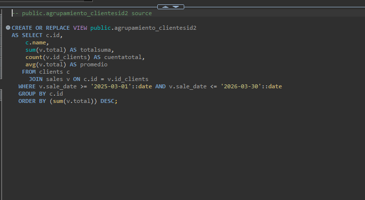


También se le pueden colocar condiciones a las consultas agrupadas. Para este caso utilice la clausula Having., e la siguiente manera:

Forma 1:

``` {.script style="color: blue"}
create or replace view agrupamiento_clientesid_having
as

SELECT 
    C.id, 
    C.name, 
    SUM(V.total) AS TotalSuma, 
    COUNT(V.id_clients) AS CuentaTotal, 
    AVG(V.total) AS Promedio  
FROM clients C
JOIN sales V ON C.id = V.id_clients
WHERE V.sale_date BETWEEN '2025-03-01' AND '2026-03-30'
GROUP BY C.id, C.name
HAVING COUNT(V.id_clients) >= 2
ORDER BY TotalSuma DESC;
```

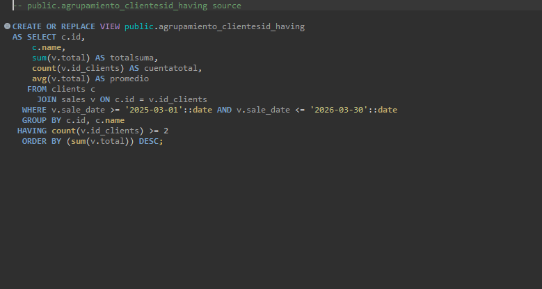

teniendo como resultado

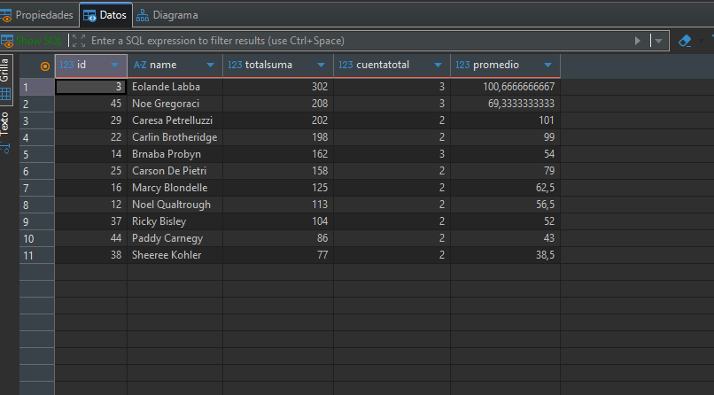

Forma 2:

``` {.script style="color: blue"}
CREATE OR REPLACE VIEW agrupamiento_clientesid_having2 AS
SELECT 
    C.id, 
    C.name, 
    SUM(V.total) AS TotalSuma, 
    COUNT(V.id_clients) AS CuentaTotal, 
    AVG(V.total) AS Promedio  
FROM clients C
JOIN sales V ON C.id = V.id_clients
WHERE V.sale_date BETWEEN '2025-03-01' AND '2026-03-30'
GROUP BY C.id, C.name
HAVING COUNT(V.id_clients) >= 2
ORDER BY SUM(V.total) DESC;
```

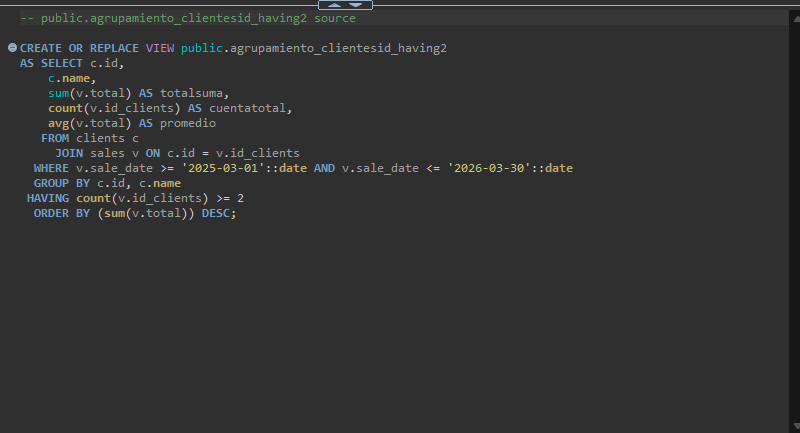

y su resultado

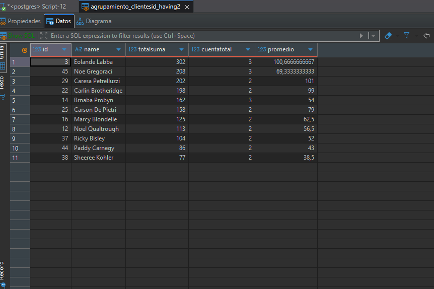
