# 📊 Actividad Semana 9 - Base de Datos

En este documento se presenta todo el proceso solicitado en la actividad de la semana 9.

# Gestor Dbeaver

------------------------------------------------------------------------

# 

# 1. Generación de datos con Mockaroo

Para comenzar, se utilizó la herramienta **Mockaroo** para generar registros de prueba.

Al solicitar los datos, se obtiene un archivo SQL con todos los registros necesarios para cada tabla.

{width="600"}

Como se muestra en la imagen.

------------------------------------------------------------------------

# 2. Consultas avanzadas con operadores

Después de generar los datos, se realizan consultas usando operadores lógicos como:

`=`, `>`, `>=`, `<`, `<=`, `LIKE`, `BETWEEN`

------------------------------------------------------------------------

## 2.1 Operador "=" (Igualdad)

``` sql
SELECT * FROM clients WHERE status = 'Activo';
```

Filtra los clientes cuyo estado sea **Activo**.

{width="560"}

------------------------------------------------------------------------

## 2.2 Operador "\>" (Mayor que)

``` sql
SELECT * FROM sales WHERE total > 100;
```

Muestra las ventas cuyo total es mayor a 100.

{width="531"}

------------------------------------------------------------------------

## 2.3 Operador "\>=" (Mayor o igual)

``` sql
SELECT * FROM sales WHERE total >= 50;
```

Obtiene las ventas con total mayor o igual a 50.

{width="543"}

------------------------------------------------------------------------

## 2.4 Operador "\<" (Menor que)

``` sql
SELECT * FROM sales_details WHERE quantity < 9;
```

Muestra los productos con cantidad menor a 9.

{width="492"}

------------------------------------------------------------------------

## 2.5 Operador "\<=" (Menor o igual)

``` sql
SELECT *  FROM sales_details  WHERE quantity <= 8;
```

Muestra los productos con cantidad menor o igual a 8.


------------------------------------------------------------------------

## 2.6 Operador LIKE

``` sql
SELECT * FROM clients WHERE email LIKE 'm%';
```

Busca clientes cuyo correo comienza con la letra "m".


------------------------------------------------------------------------

## 2.7 Operador BETWEEN

``` sql
SELECT * FROM sales WHERE sale_date BETWEEN '2025-01-01' AND '2025-12-31';
```

Obtiene las ventas realizadas dentro del año 2025.


------------------------------------------------------------------------

## 2.8 Consulta combinada

``` sql
SELECT C.name, V.total FROM clients C JOIN sales V ON C.id = V.id_clients WHERE V.total >= 50 AND V.sale_date BETWEEN '2025-01-01' AND '2026-01-01';
```

Muestra los clientes con ventas mayores o iguales a 50 dentro de un rango de fechas.


------------------------------------------------------------------------

------------------------------------------------------------------------

#  3. Consultas de agrupamiento

------------------------------------------------------------------------

## 3.1 Agrupamiento con 1 tabla

``` sql
SELECT status, COUNT(*) AS total_clientes
FROM clients
GROUP BY status;
```

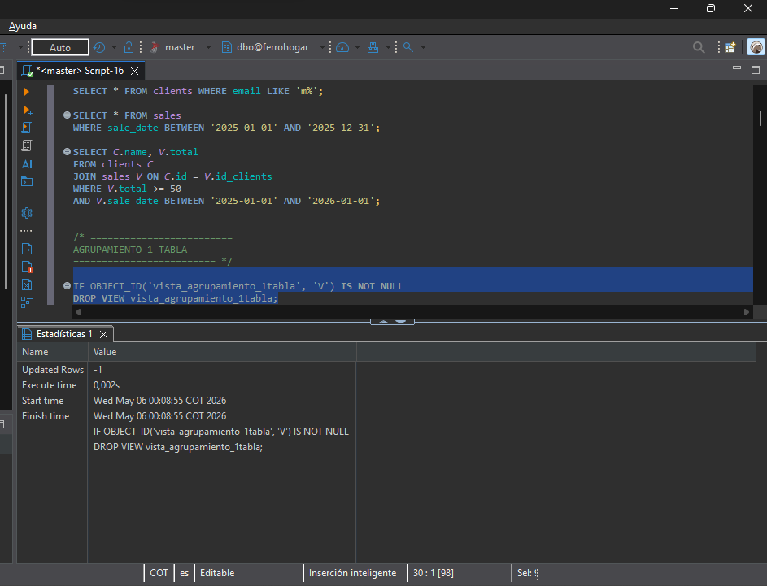Agrupa los clientes por estado y cuenta cuántos hay en cada grupo.

------------------------------------------------------------------------

### 🔹 Creación de la Vista

``` sql
IF OBJECT_ID('vista_agrupamiento_1tabla', 'V') IS NOT NULL
DROP VIEW vista_agrupamiento_1tabla;
GO

CREATE VIEW vista_agrupamiento_1tabla AS
SELECT status, COUNT(*) AS total_clientes
FROM clients
GROUP BY status;
GO
```

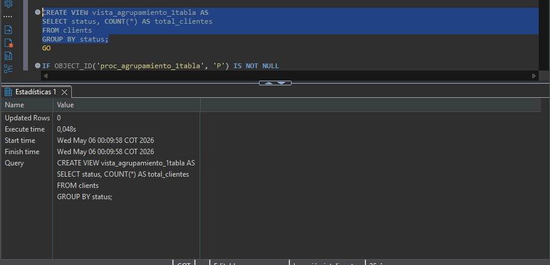Verificación en la sección de vistas:

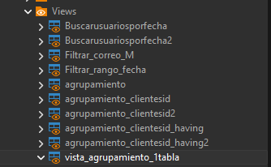

Source:

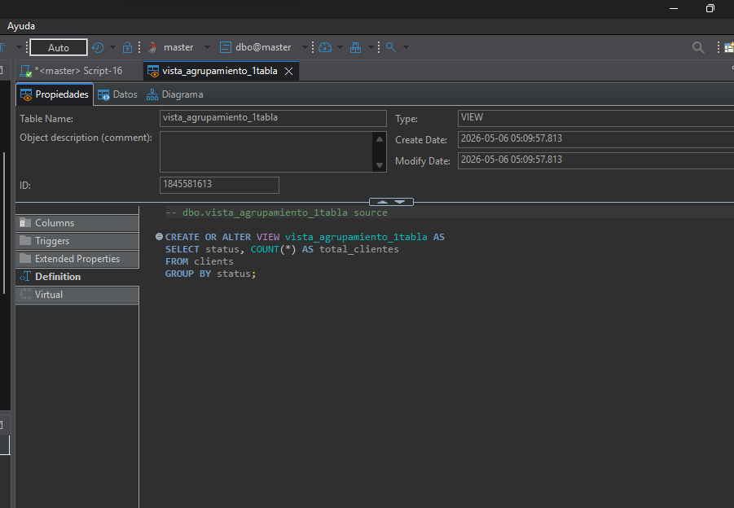

Datos:

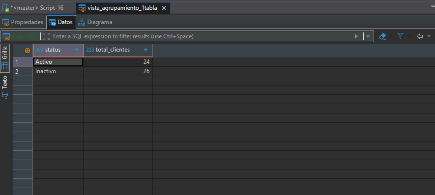

------------------------------------------------------------------------

### ⚙️ Creación del Procedimiento

``` sql
IF OBJECT_ID('proc_agrupamiento_1tabla', 'P') IS NOT NULL
DROP PROCEDURE proc_agrupamiento_1tabla;
GO

CREATE PROCEDURE proc_agrupamiento_1tabla
AS
BEGIN
    SELECT status, COUNT(*) AS total_clientes
    FROM clients
    GROUP BY status;
END;
GO
```

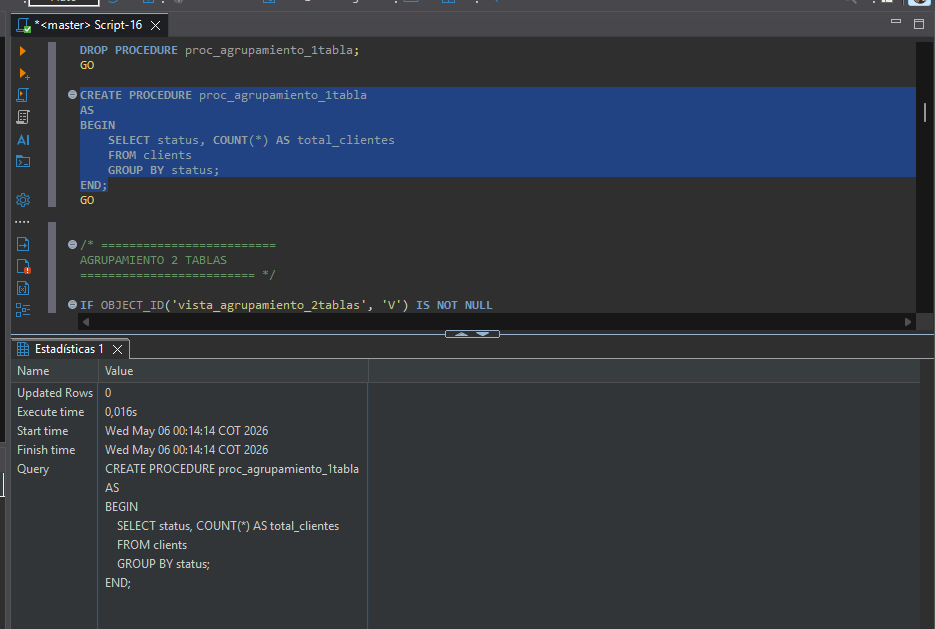Verificación:

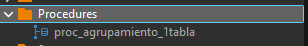

Source:

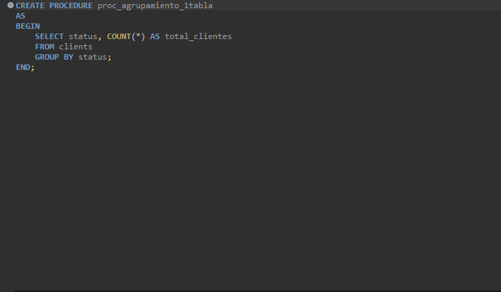

------------------------------------------------------------------------

## 3.2 Agrupamiento con 2 tablas

``` sql
SELECT C.name, COUNT(V.id) AS total_ventas
FROM clients C
JOIN sales V ON C.id = V.id_clients
GROUP BY C.name;
```

Cuenta cuántas ventas ha realizado cada cliente.

------------------------------------------------------------------------

### 🔹 Creación de la Vista

``` sql
IF OBJECT_ID('vista_agrupamiento_2tablas', 'V') IS NOT NULL
DROP VIEW vista_agrupamiento_2tablas;
GO

CREATE VIEW vista_agrupamiento_2tablas AS
SELECT C.name, COUNT(V.id) AS total_ventas
FROM clients C
JOIN sales V ON C.id = V.id_clients
GROUP BY C.name;
GO
```

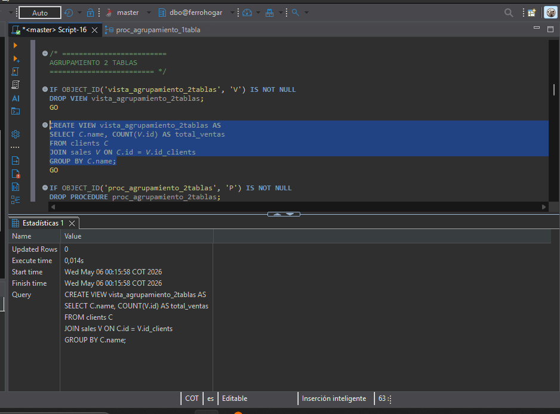Verificación:

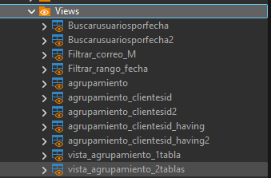

Source:

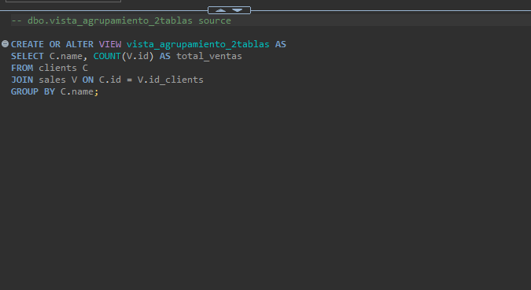

Datos:

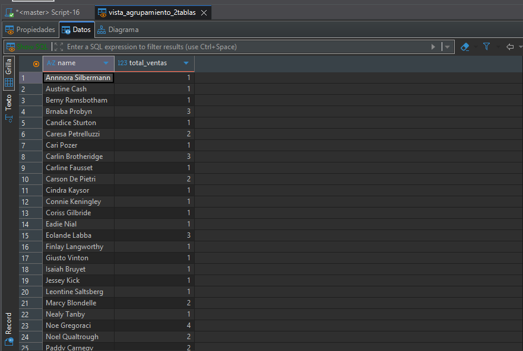

------------------------------------------------------------------------

### ⚙️ Creación del Procedimiento

``` sql
IF OBJECT_ID('proc_agrupamiento_2tablas', 'P') IS NOT NULL
DROP PROCEDURE proc_agrupamiento_2tablas;
GO

CREATE PROCEDURE proc_agrupamiento_2tablas
AS
BEGIN
    SELECT C.name, COUNT(V.id) AS total_ventas
    FROM clients C
    JOIN sales V ON C.id = V.id_clients
    GROUP BY C.name;
END;
GO
```

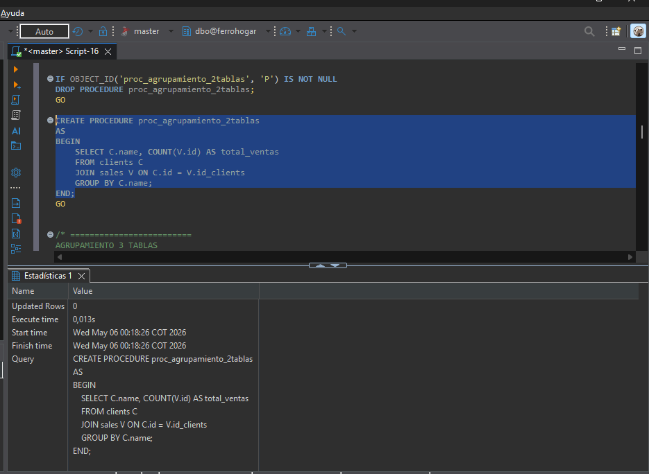Verificación:

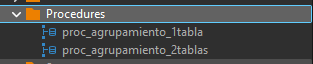

Source:

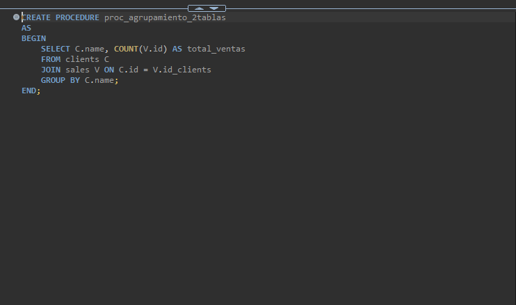

------------------------------------------------------------------------

## 3.3 Agrupamiento con 3 tablas

``` sql
SELECT C.name AS cliente, P.name AS producto, SUM(PV.quantity) AS total_comprado
FROM clients C
JOIN sales V ON C.id = V.id_clients
JOIN sales_details PV ON V.id = PV.id_sales
JOIN products P ON P.id = PV.id_products
GROUP BY C.name, P.name;
```

Muestra cuánto ha comprado cada cliente de cada producto.

------------------------------------------------------------------------

### 🔹 Creación de la Vista

``` sql
IF OBJECT_ID('vista_agrupamiento_3tablas', 'V') IS NOT NULL
DROP VIEW vista_agrupamiento_3tablas;
GO

CREATE VIEW vista_agrupamiento_3tablas AS
SELECT C.name AS cliente, P.name AS producto, SUM(PV.quantity) AS total_comprado
FROM clients C
JOIN sales V ON C.id = V.id_clients
JOIN sales_details PV ON V.id = PV.id_sales
JOIN products P ON P.id = PV.id_products
GROUP BY C.name, P.name;
GO
```

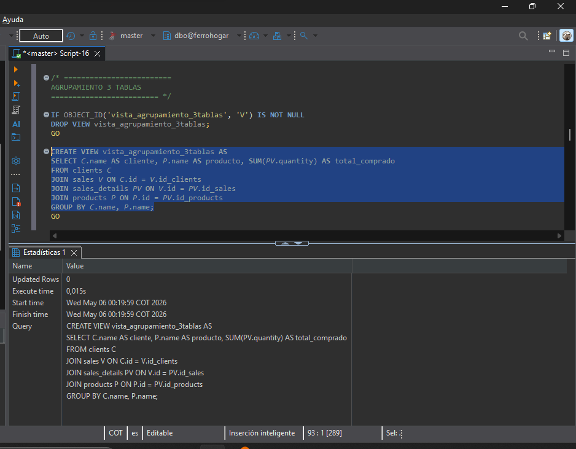Verificación:

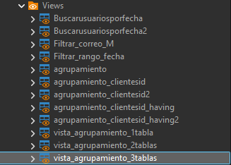

Source:

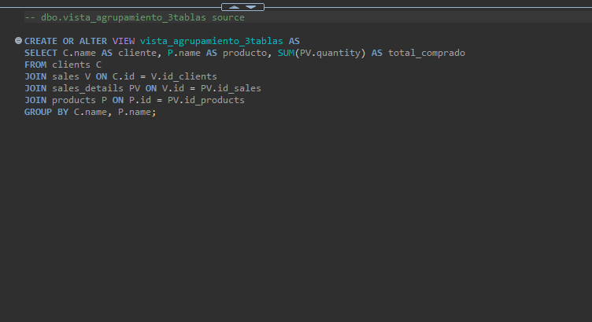

Datos:

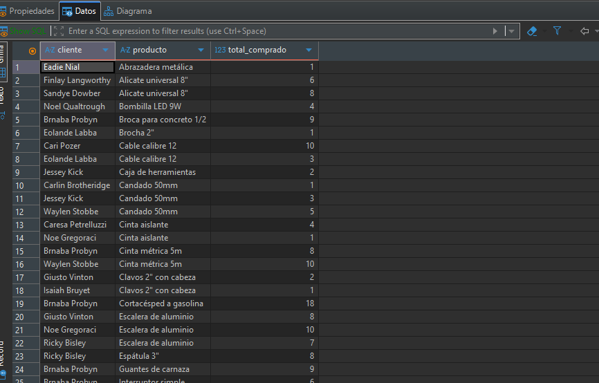

------------------------------------------------------------------------

### ⚙️ Creación del Procedimiento

``` sql
IF OBJECT_ID('proc_agrupamiento_3tablas', 'P') IS NOT NULL
DROP PROCEDURE proc_agrupamiento_3tablas;
GO

CREATE PROCEDURE proc_agrupamiento_3tablas
AS
BEGIN
    SELECT C.name AS cliente, P.name AS producto, SUM(PV.quantity) AS total_comprado
    FROM clients C
    JOIN sales V ON C.id = V.id_clients
    JOIN sales_details PV ON V.id = PV.id_sales
    JOIN products P ON P.id = PV.id_products
    GROUP BY C.name, P.name;
END;
GO
```

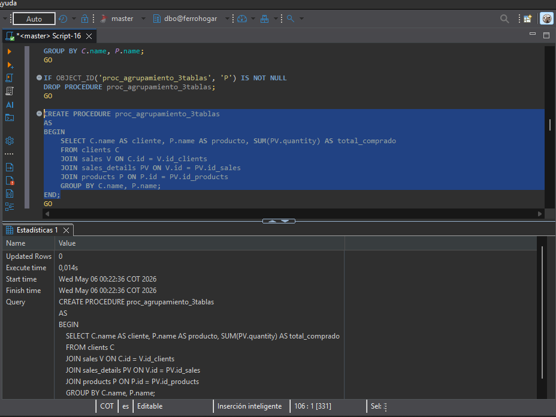Verificación:

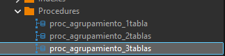

Source:

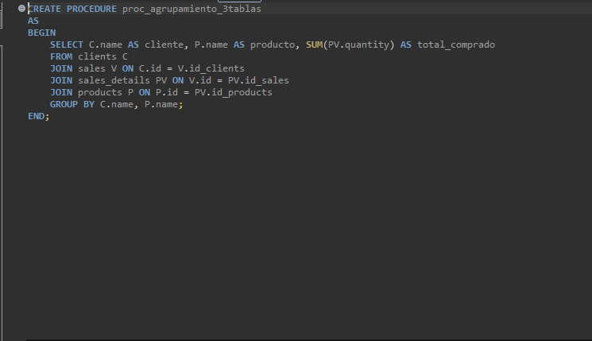

------------------------------------------------------------------------

# 🔍 4. Subconsultas

------------------------------------------------------------------------

## 4.1 Subconsulta con 1 tabla

``` sql
SELECT *
FROM clients
WHERE id IN (
    SELECT id_clients
    FROM sales
);
```

Muestra los clientes que han realizado al menos una venta.

------------------------------------------------------------------------

### 🔹 Vista

``` sql
IF OBJECT_ID('vista_subconsulta_1tabla', 'V') IS NOT NULL
DROP VIEW vista_subconsulta_1tabla;
GO

CREATE VIEW vista_subconsulta_1tabla AS
SELECT *
FROM clients
WHERE id IN (
    SELECT id_clients FROM sales
);
GO
```

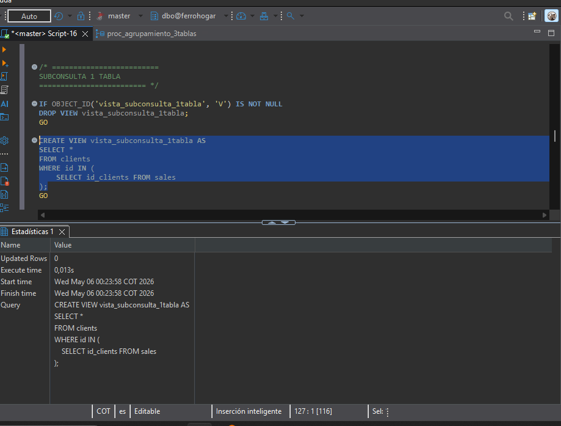Verificación:

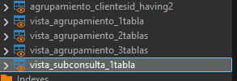

Source:

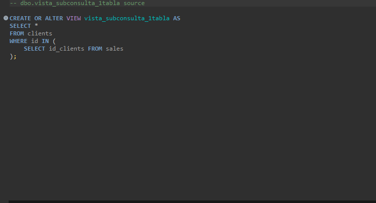

Datos:

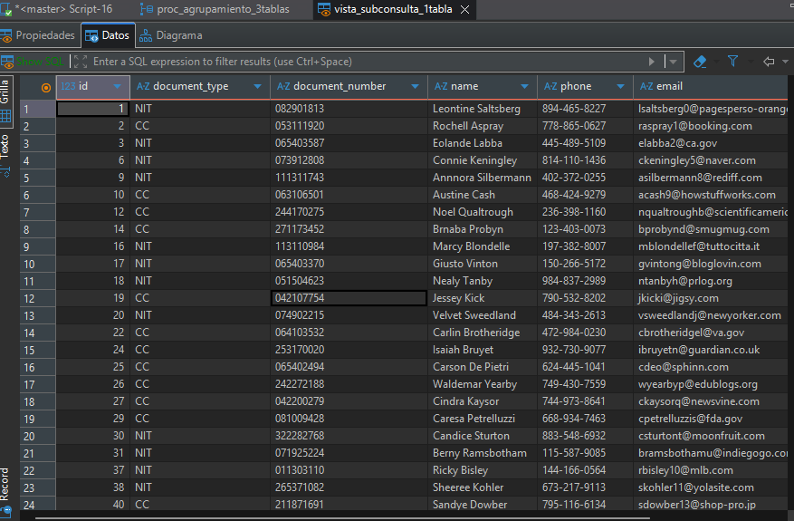

------------------------------------------------------------------------

### ⚙️ Procedimiento

``` sql
IF OBJECT_ID('proc_subconsulta_1tabla', 'P') IS NOT NULL
DROP PROCEDURE proc_subconsulta_1tabla;
GO

CREATE PROCEDURE proc_subconsulta_1tabla
AS
BEGIN
    SELECT *
    FROM clients
    WHERE id IN (
        SELECT id_clients FROM sales
    );
END;
GO
```

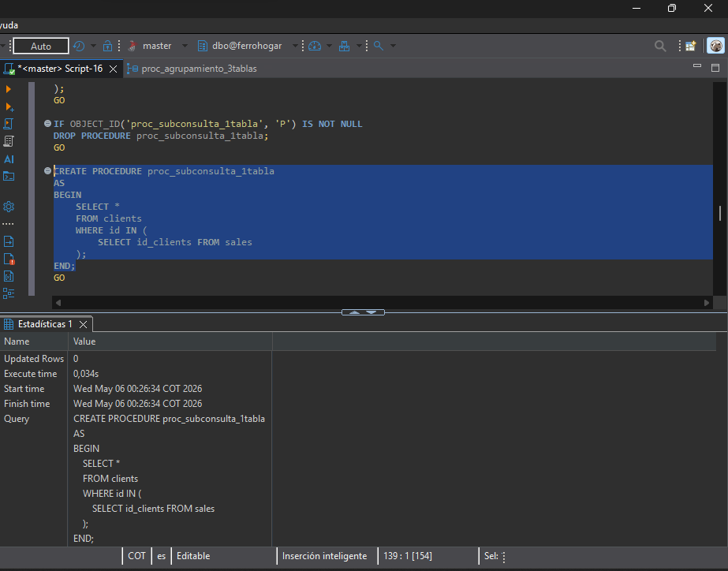Verificación:

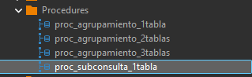

Source:

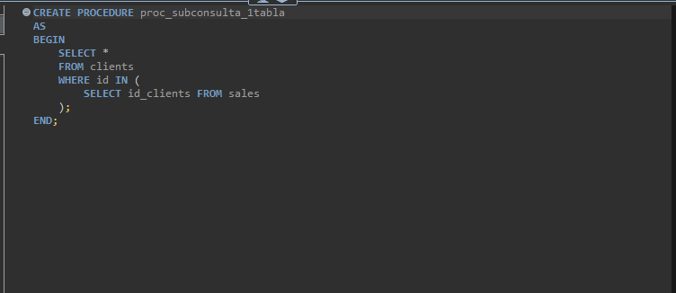

------------------------------------------------------------------------

## 4.2 Subconsulta con 2 tablas

``` sql
SELECT *
FROM clients
WHERE id IN (
    SELECT id_clients
    FROM sales
    WHERE total > 100
);
```

Muestra los clientes que han realizado ventas mayores a 100.

------------------------------------------------------------------------

### 🔹 Vista

``` sql
IF OBJECT_ID('vista_subconsulta_2tablas', 'V') IS NOT NULL
DROP VIEW vista_subconsulta_2tablas;
GO

CREATE VIEW vista_subconsulta_2tablas AS
SELECT *
FROM clients
WHERE id IN (
    SELECT id_clients
    FROM sales
    WHERE total > 100
);
GO
```

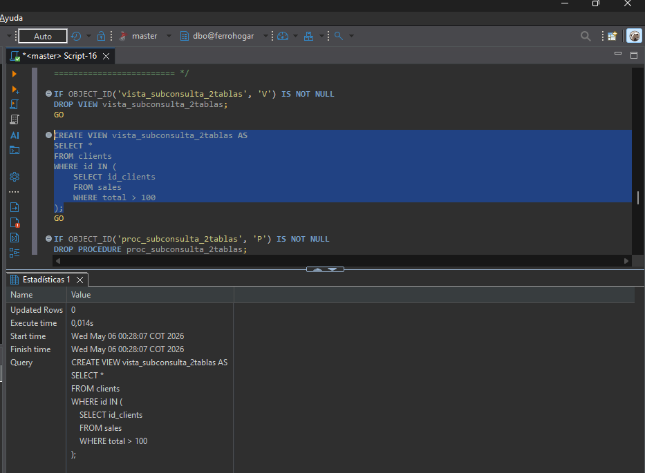Verificación:

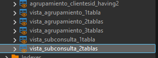

Source:

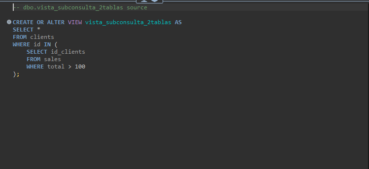

Datos:

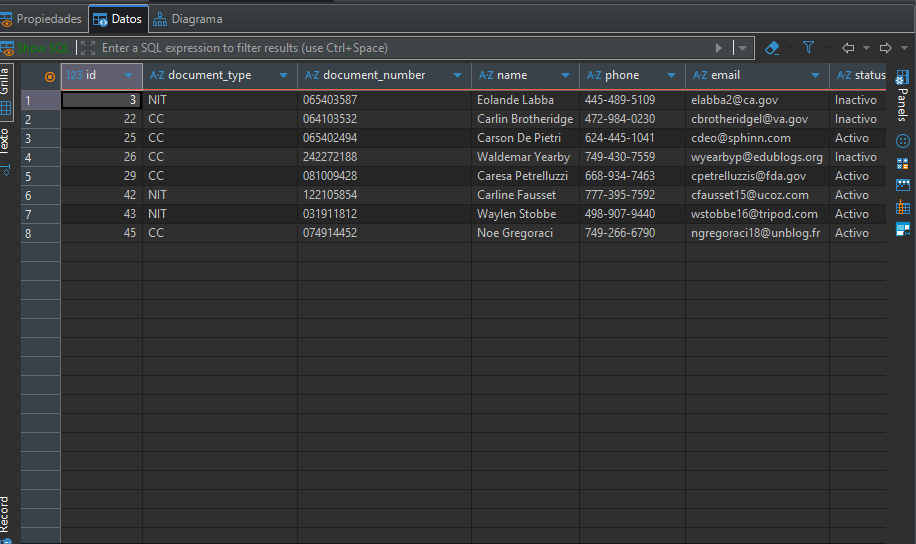

------------------------------------------------------------------------

### ⚙️ Procedimiento

``` sql
IF OBJECT_ID('proc_subconsulta_2tablas', 'P') IS NOT NULL
DROP PROCEDURE proc_subconsulta_2tablas;
GO

CREATE PROCEDURE proc_subconsulta_2tablas
AS
BEGIN
    SELECT *
    FROM clients
    WHERE id IN (
        SELECT id_clients
        FROM sales
        WHERE total > 100
    );
END;
GO
```

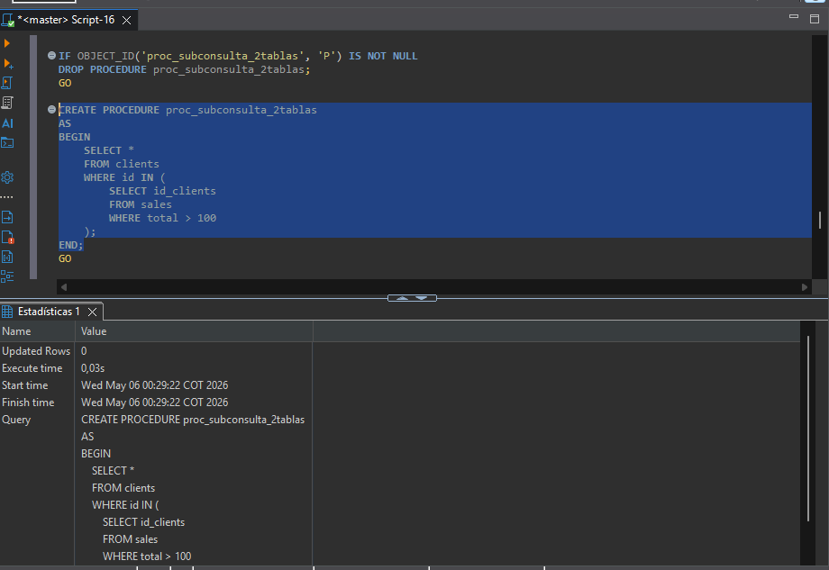

Verificación:

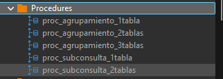

Source:

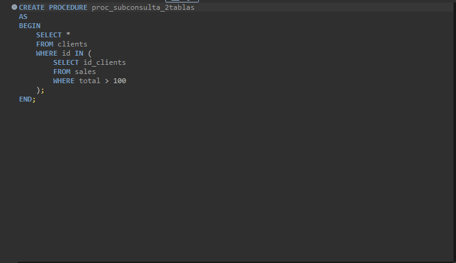

------------------------------------------------------------------------

## 4.3 Subconsulta con 3 tablas

``` sql
SELECT *
FROM clients
WHERE id IN (
    SELECT V.id_clients
    FROM sales V
    JOIN sales_details PV ON V.id = PV.id_sales
    WHERE PV.quantity >= 5
);
```

Muestra los clientes que han comprado productos con cantidad mayor o igual a 5.

------------------------------------------------------------------------

### 🔹 Vista

``` sql
IF OBJECT_ID('vista_subconsulta_3tablas', 'V') IS NOT NULL
DROP VIEW vista_subconsulta_3tablas;
GO

CREATE VIEW vista_subconsulta_3tablas AS
SELECT *
FROM clients
WHERE id IN (
    SELECT V.id_clients
    FROM sales V
    JOIN sales_details PV ON V.id = PV.id_sales
    WHERE PV.quantity >= 5
);
GO
```

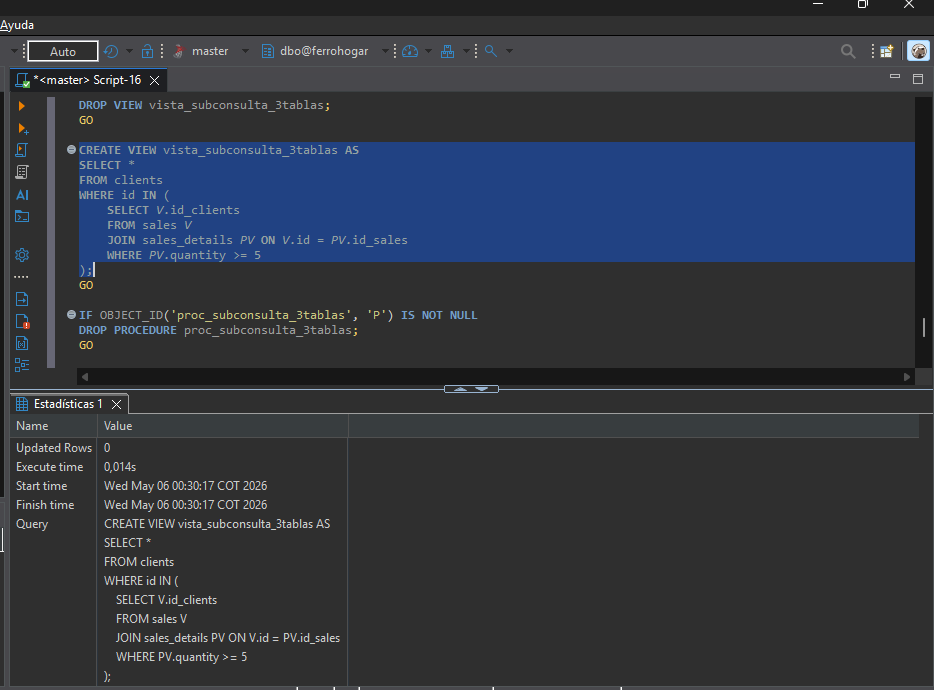

Verificación:

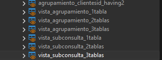

Source:

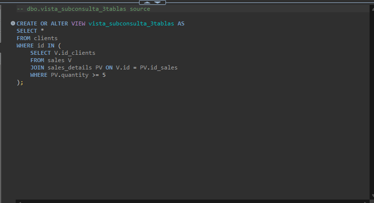

Datos:

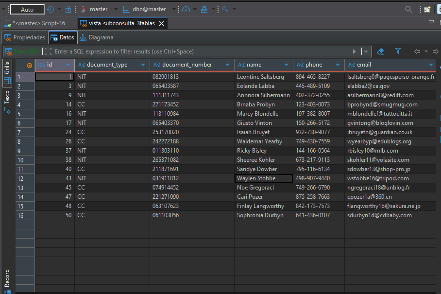

------------------------------------------------------------------------

### ⚙️ Procedimiento

``` sql
IF OBJECT_ID('proc_subconsulta_3tablas', 'P') IS NOT NULL
DROP PROCEDURE proc_subconsulta_3tablas;
GO

CREATE PROCEDURE proc_subconsulta_3tablas
AS
BEGIN
    SELECT *
    FROM clients
    WHERE id IN (
        SELECT V.id_clients
        FROM sales V
        JOIN sales_details PV ON V.id = PV.id_sales
        WHERE PV.quantity >= 5
    );
END;
GO
```

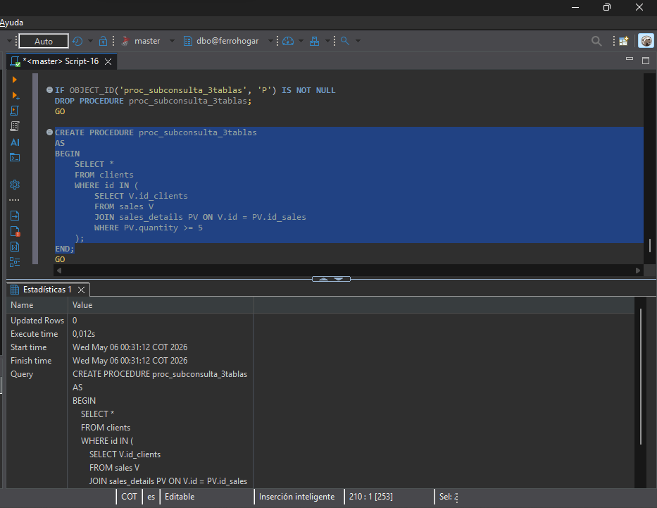

Verificación:

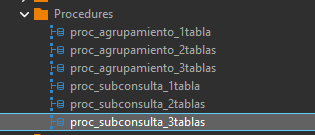

Source:

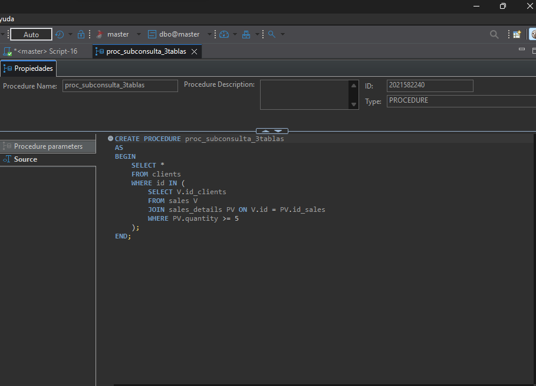

------------------------------------------------------------------------

Aquí concluimos la actividad realizada mediante DBeaver utilizando el motor SQL Server

# Gestor Sql Management

# 1. Generación de datos con Mockaroo

Para comenzar, se utilizó la herramienta **Mockaroo** para generar registros de prueba.

Al solicitar los datos, se obtiene un archivo SQL con todos los registros necesarios para cada tabla.

{width="600"}

Como se muestra en la imagen.

------------------------------------------------------------------------

# 2. Consultas avanzadas con operadores

Después de generar los datos, se realizan consultas usando operadores lógicos como:

`=`, `>`, `>=`, `<`, `<=`, `LIKE`, `BETWEEN`

------------------------------------------------------------------------

## 2.1 Operador "=" (Igualdad)

``` sql
SELECT * FROM clients WHERE status = 'Activo';
```

Filtra los clientes cuyo estado sea **Activo**.

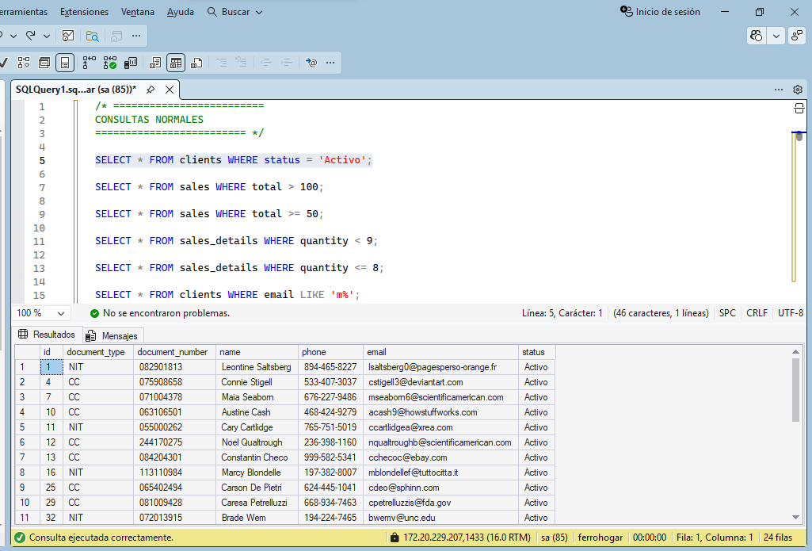

------------------------------------------------------------------------

## 2.2 Operador "\>" (Mayor que)

``` sql
SELECT * FROM sales WHERE total > 100;
```

Muestra las ventas cuyo total es mayor a 100.

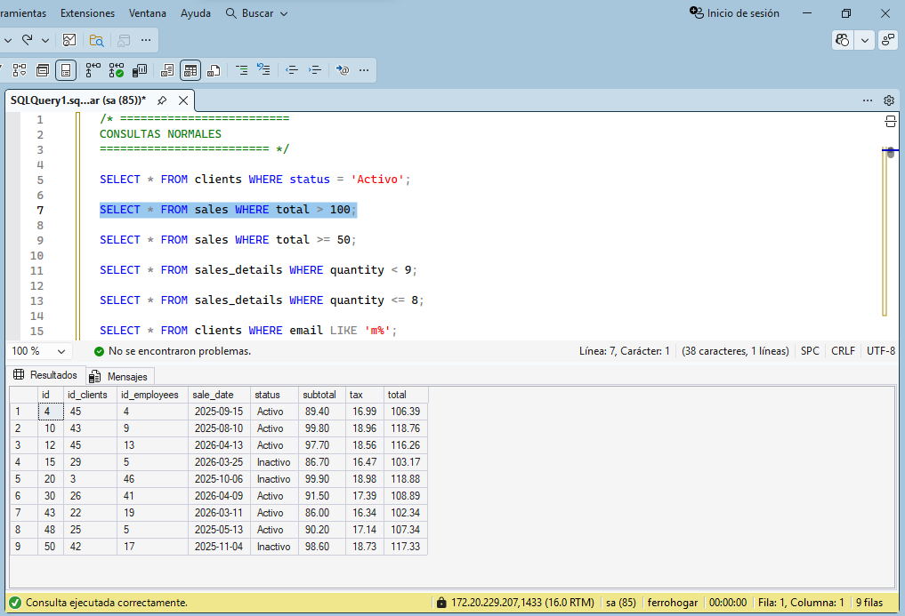

------------------------------------------------------------------------

## 2.3 Operador "\>=" (Mayor o igual)

``` sql
SELECT * FROM sales WHERE total >= 50;
```

Obtiene las ventas con total mayor o igual a 50.

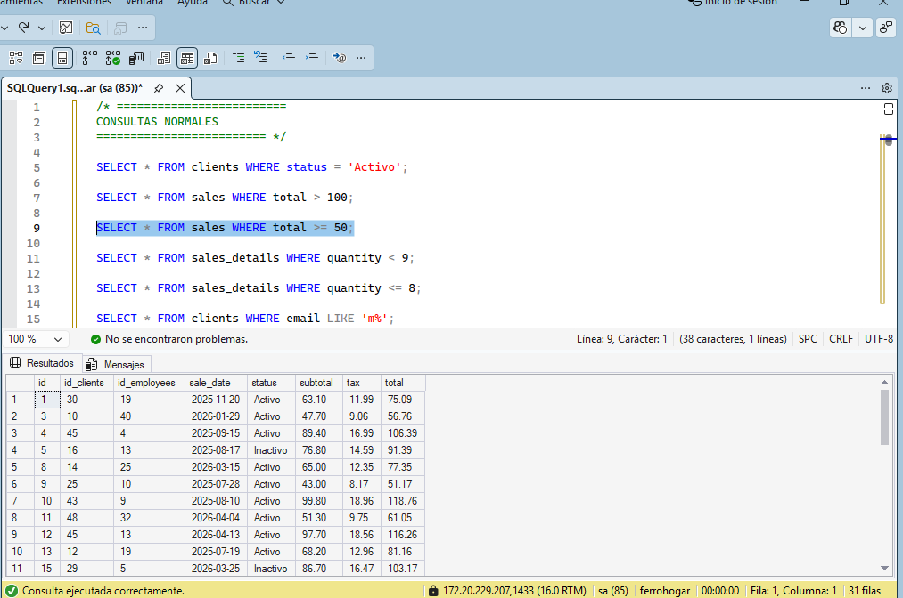

------------------------------------------------------------------------

## 2.4 Operador "\<" (Menor que)

``` sql
SELECT * FROM sales_details WHERE quantity < 9;
```

Muestra los productos con cantidad menor a 9.

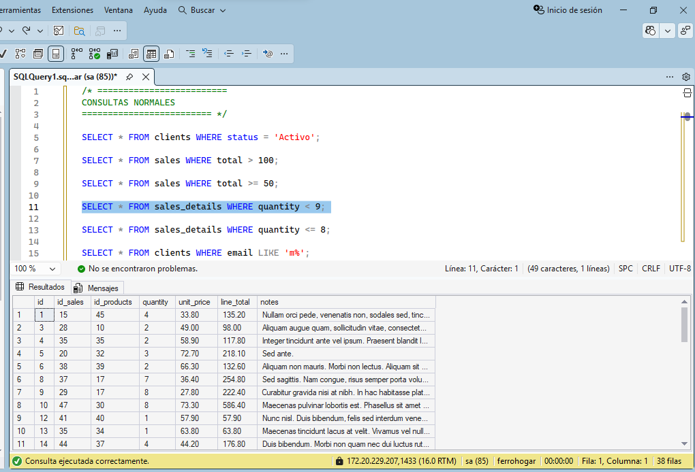

------------------------------------------------------------------------

## 2.5 Operador "\<=" (Menor o igual)

``` sql
SELECT *  FROM sales_details  WHERE quantity <= 8;
```

Muestra los productos con cantidad menor o igual a 8.

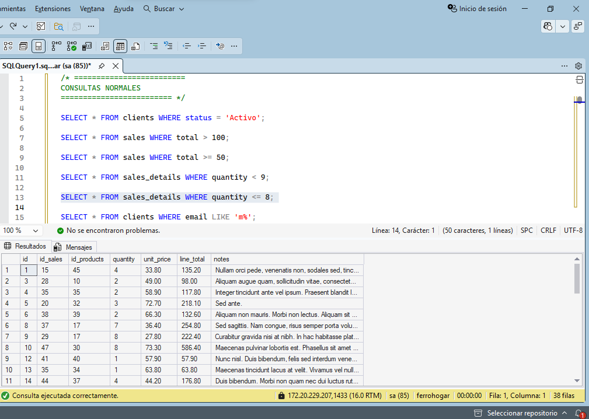

------------------------------------------------------------------------

## 2.6 Operador LIKE

``` sql
SELECT * FROM clients WHERE email LIKE 'm%';
```

Busca clientes cuyo correo comienza con la letra "m".

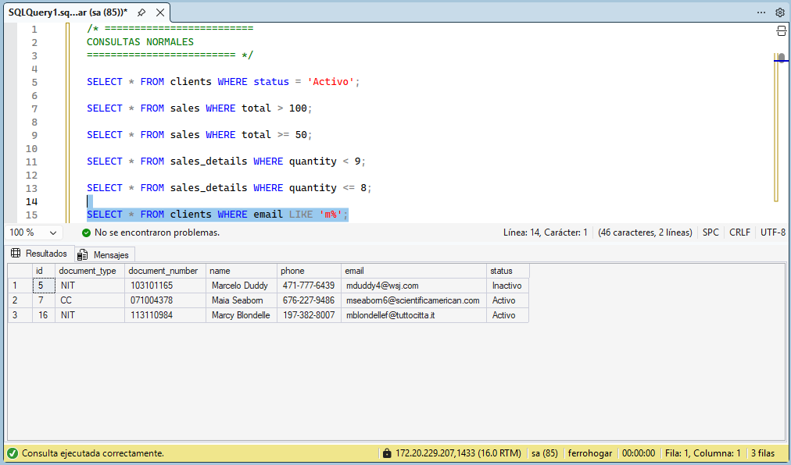

------------------------------------------------------------------------

## 2.7 Operador BETWEEN

``` sql
SELECT * FROM sales WHERE sale_date BETWEEN '2025-01-01' AND '2025-12-31';
```

Obtiene las ventas realizadas dentro del año 2025.

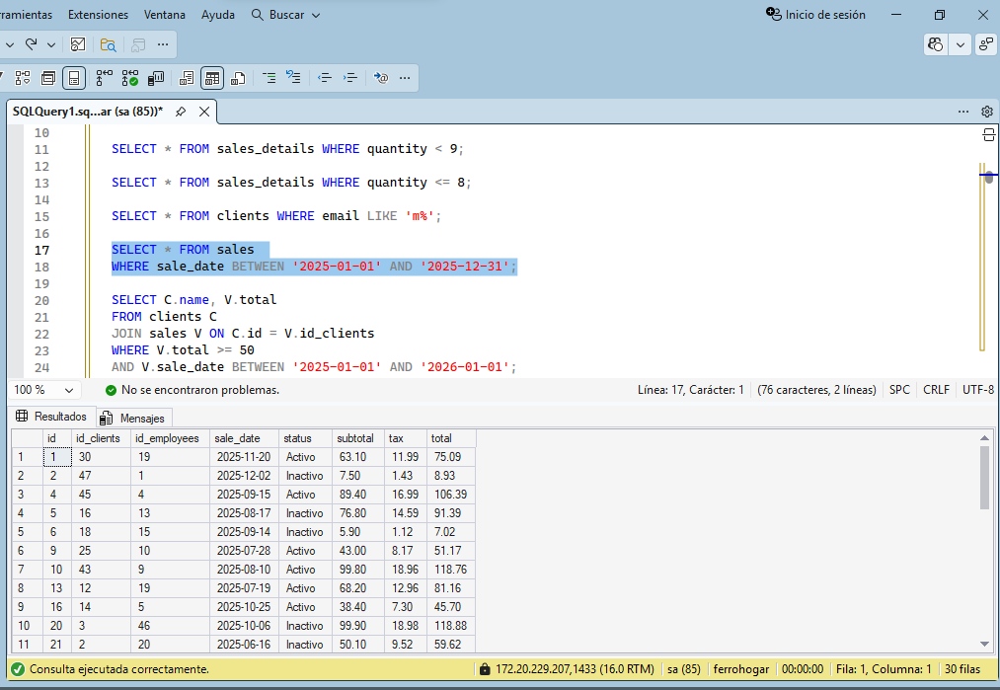

------------------------------------------------------------------------

## 2.8 Consulta combinada

``` sql
SELECT C.name, V.total FROM clients C JOIN sales V ON C.id = V.id_clients WHERE V.total >= 50 AND V.sale_date BETWEEN '2025-01-01' AND '2026-01-01';
```

Muestra los clientes con ventas mayores o iguales a 50 dentro de un rango de fechas.

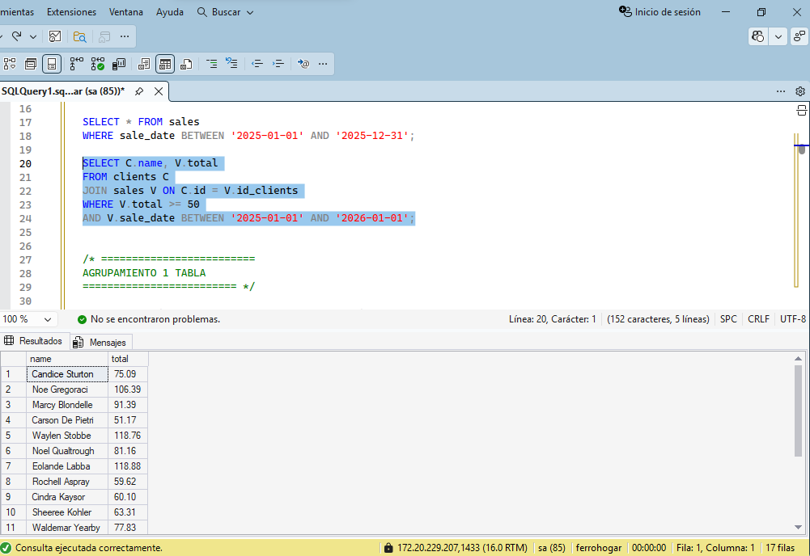

------------------------------------------------------------------------

------------------------------------------------------------------------

#  3. Consultas de agrupamiento

------------------------------------------------------------------------

## 3.1 Agrupamiento con 1 tabla

``` sql
SELECT status, COUNT(*) AS total_clientes FROM clients GROUP BY status;
```

Agrupa los clientes por estado y cuenta cuántos hay en cada grupo.

------------------------------------------------------------------------

### 🔹 Creación de la Vista

``` sql
IF OBJECT_ID('vista_agrupamiento_1tabla', 'V') IS NOT NULL DROP VIEW vista_agrupamiento_1tabla; GO  CREATE VIEW vista_agrupamiento_1tabla AS SELECT status, COUNT(*) AS total_clientes FROM clients GROUP BY status; GO
```

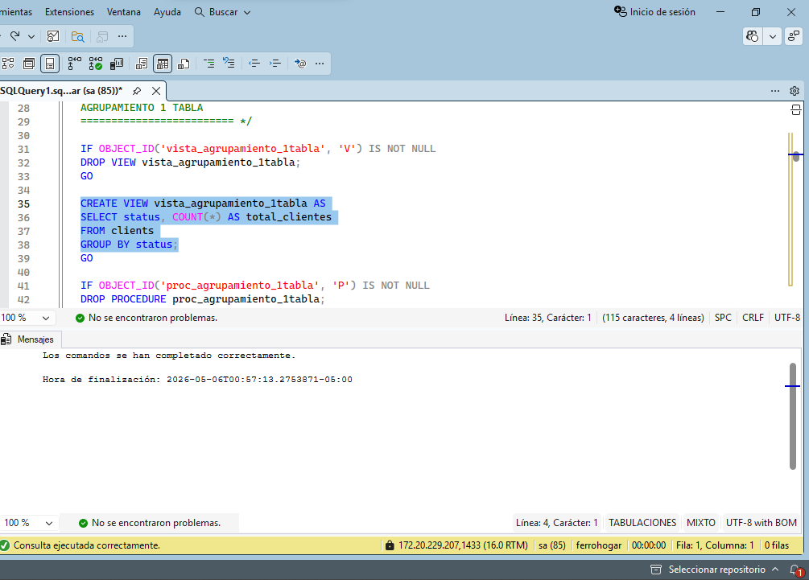Verificación en la sección de vistas:

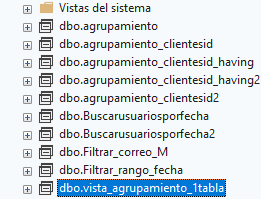

Source:

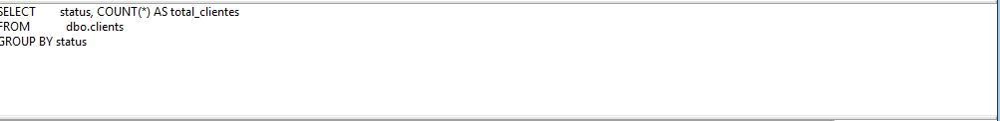

⚙️ Creación del Procedimiento

``` sql
IF OBJECT_ID('proc_agrupamiento_1tabla', 'P') IS NOT NULL DROP PROCEDURE proc_agrupamiento_1tabla; GO  CREATE PROCEDURE proc_agrupamiento_1tabla AS BEGIN     SELECT status, COUNT(*) AS total_clientes     FROM clients     GROUP BY status; END; GO
```

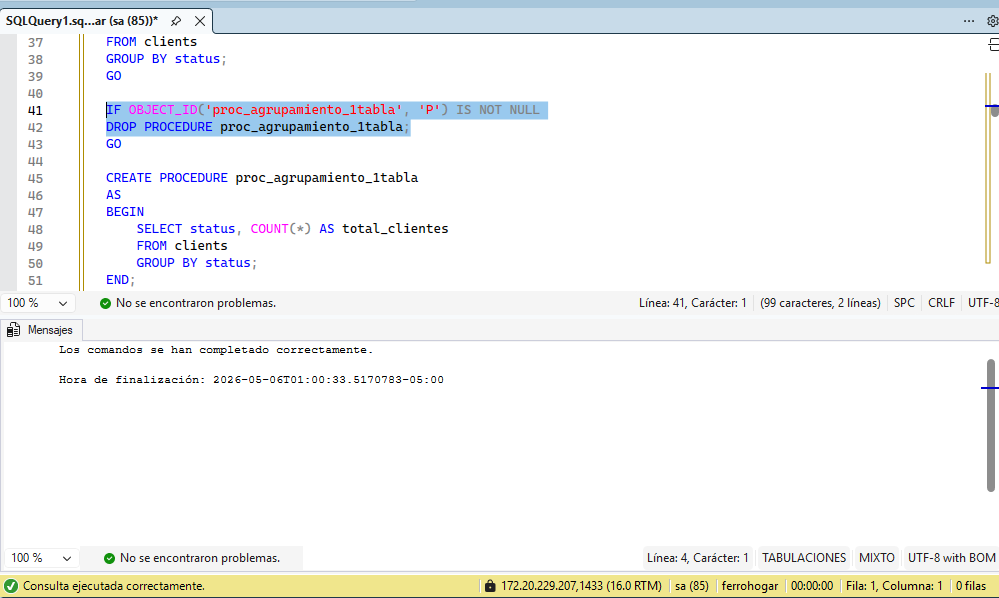Verificación:

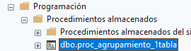

Source:

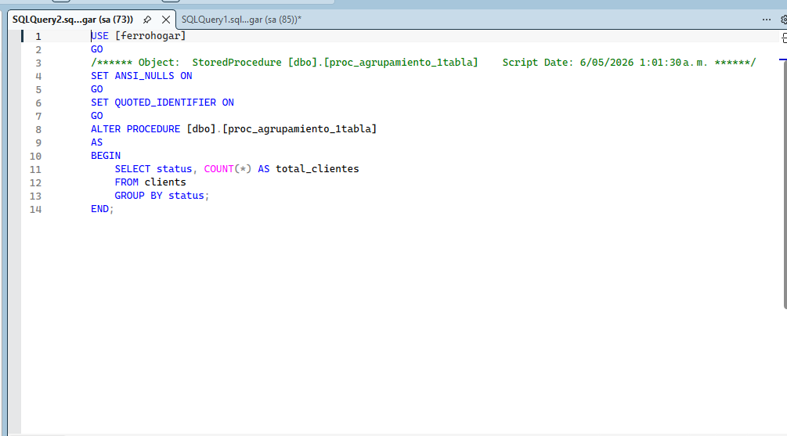

------------------------------------------------------------------------

## 3.2 Agrupamiento con 2 tablas

``` sql
SELECT C.name, COUNT(V.id) AS total_ventas FROM clients C JOIN sales V ON C.id = V.id_clients GROUP BY C.name;
```

Cuenta cuántas ventas ha realizado cada cliente.

------------------------------------------------------------------------

### 🔹 Creación de la Vista

``` sql
IF OBJECT_ID('vista_agrupamiento_2tablas', 'V') IS NOT NULL DROP VIEW vista_agrupamiento_2tablas; GO  CREATE VIEW vista_agrupamiento_2tablas AS SELECT C.name, COUNT(V.id) AS total_ventas FROM clients C JOIN sales V ON C.id = V.id_clients GROUP BY C.name; GO
```

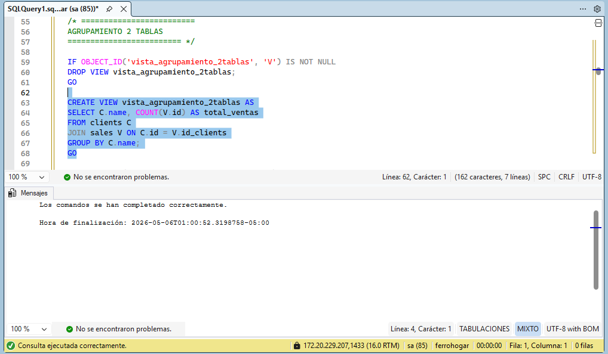Verificación:

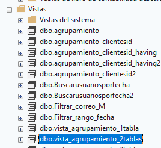

Source:

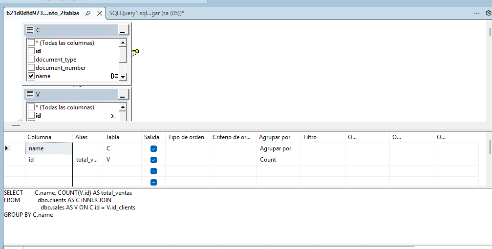⚙️ Creación del Procedimiento

``` sql
IF OBJECT_ID('proc_agrupamiento_2tablas', 'P') IS NOT NULL DROP PROCEDURE proc_agrupamiento_2tablas; GO  CREATE PROCEDURE proc_agrupamiento_2tablas AS BEGIN     SELECT C.name, COUNT(V.id) AS total_ventas     FROM clients C     JOIN sales V ON C.id = V.id_clients     GROUP BY C.name; END; GO
```

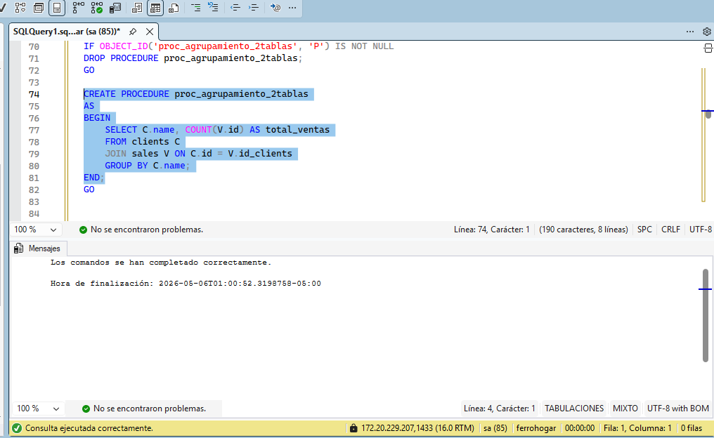Verificación:

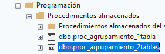

Source:

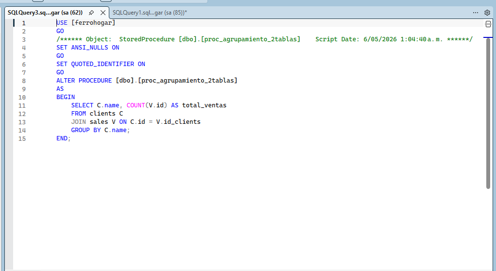

------------------------------------------------------------------------

## 3.3 Agrupamiento con 3 tablas

``` sql
SELECT C.name AS cliente, P.name AS producto, SUM(PV.quantity) AS total_comprado FROM clients C JOIN sales V ON C.id = V.id_clients JOIN sales_details PV ON V.id = PV.id_sales JOIN products P ON P.id = PV.id_products GROUP BY C.name, P.name;
```

Muestra cuánto ha comprado cada cliente de cada producto.

------------------------------------------------------------------------

### 🔹 Creación de la Vista

``` sql
IF OBJECT_ID('vista_agrupamiento_3tablas', 'V') IS NOT NULL DROP VIEW vista_agrupamiento_3tablas; GO  CREATE VIEW vista_agrupamiento_3tablas AS SELECT C.name AS cliente, P.name AS producto, SUM(PV.quantity) AS total_comprado FROM clients C JOIN sales V ON C.id = V.id_clients JOIN sales_details PV ON V.id = PV.id_sales JOIN products P ON P.id = PV.id_products GROUP BY C.name, P.name; GO
```

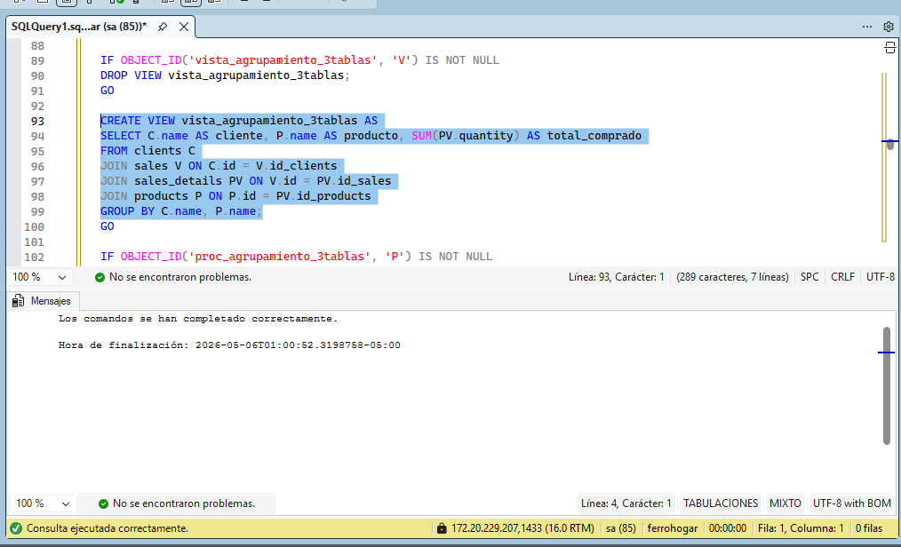Verificación:

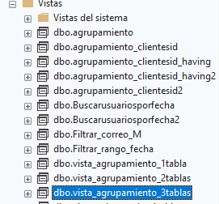

Source:

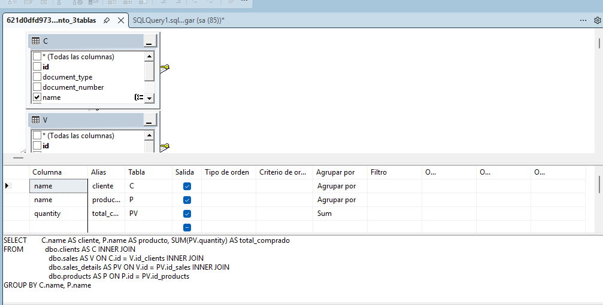

------------------------------------------------------------------------

### ⚙️ Creación del Procedimiento

``` sql
IF OBJECT_ID('proc_agrupamiento_3tablas', 'P') IS NOT NULL DROP PROCEDURE proc_agrupamiento_3tablas; GO  CREATE PROCEDURE proc_agrupamiento_3tablas AS BEGIN     SELECT C.name AS cliente, P.name AS producto, SUM(PV.quantity) AS total_comprado     FROM clients C     JOIN sales V ON C.id = V.id_clients     JOIN sales_details PV ON V.id = PV.id_sales     JOIN products P ON P.id = PV.id_products     GROUP BY C.name, P.name; END; GO
```

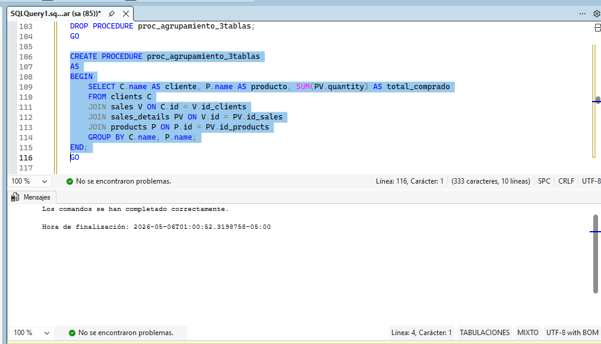Verificación:

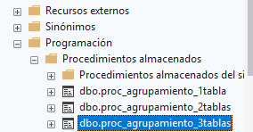

Source:

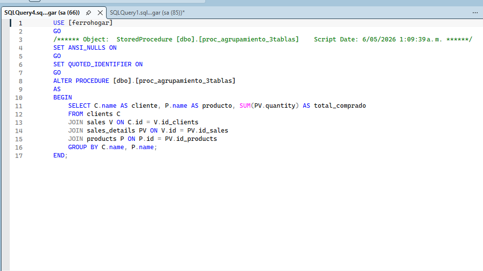

------------------------------------------------------------------------

# 🔍 4. Subconsultas

------------------------------------------------------------------------

## 4.1 Subconsulta con 1 tabla

``` sql
SELECT * FROM clients WHERE id IN (     SELECT id_clients     FROM sales );
```

Muestra los clientes que han realizado al menos una venta.

------------------------------------------------------------------------

### 🔹 Vista

``` sql
IF OBJECT_ID('vista_subconsulta_1tabla', 'V') IS NOT NULL DROP VIEW vista_subconsulta_1tabla; GO  CREATE VIEW vista_subconsulta_1tabla AS SELECT * FROM clients WHERE id IN (     SELECT id_clients FROM sales ); GO
```

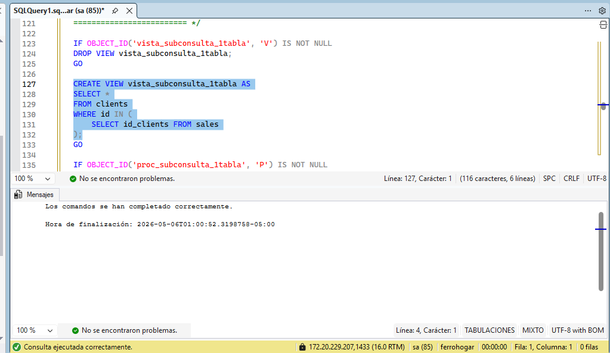Verificación:

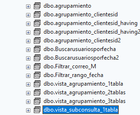

Source:

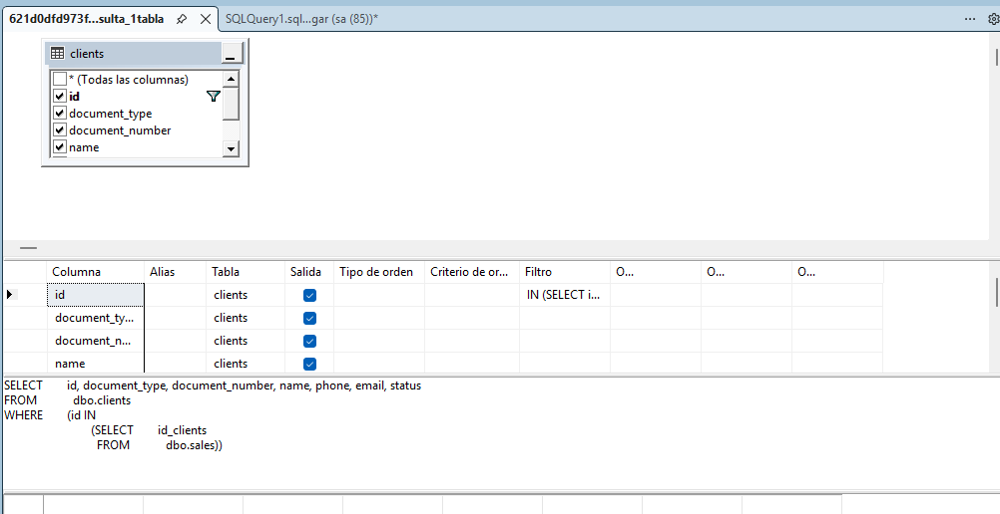

⚙️ Procedimiento

``` sql
IF OBJECT_ID('proc_subconsulta_1tabla', 'P') IS NOT NULL DROP PROCEDURE proc_subconsulta_1tabla; GO  CREATE PROCEDURE proc_subconsulta_1tabla AS BEGIN     SELECT *     FROM clients     WHERE id IN (         SELECT id_clients FROM sales     ); END; GO
```

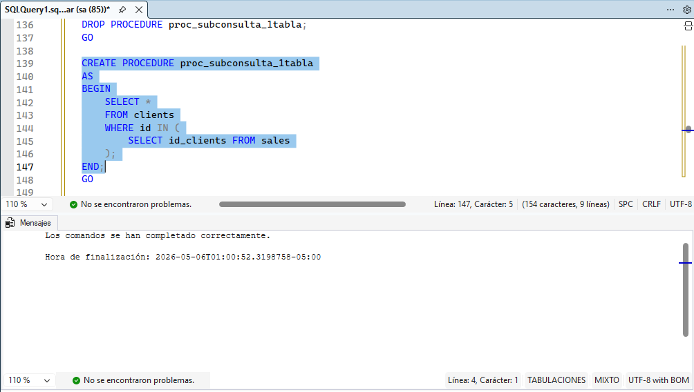Verificación:

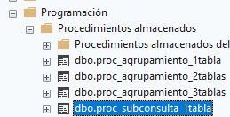

Source:

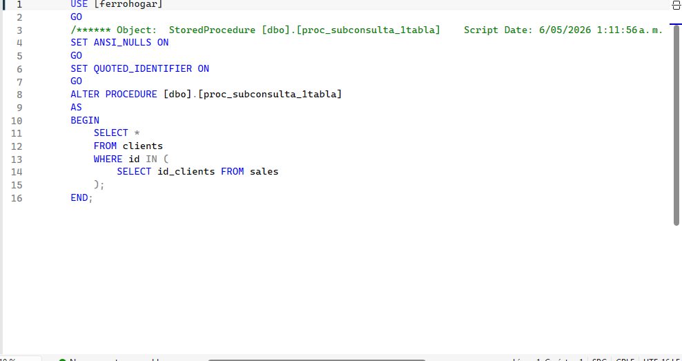

------------------------------------------------------------------------

## 4.2 Subconsulta con 2 tablas

``` sql
SELECT * FROM clients WHERE id IN (     SELECT id_clients     FROM sales     WHERE total > 100 );
```

Muestra los clientes que han realizado ventas mayores a 100.

------------------------------------------------------------------------

### 🔹 Vista

``` sql
IF OBJECT_ID('vista_subconsulta_2tablas', 'V') IS NOT NULL DROP VIEW vista_subconsulta_2tablas; GO  CREATE VIEW vista_subconsulta_2tablas AS SELECT * FROM clients WHERE id IN (     SELECT id_clients     FROM sales     WHERE total > 100 ); GO
```

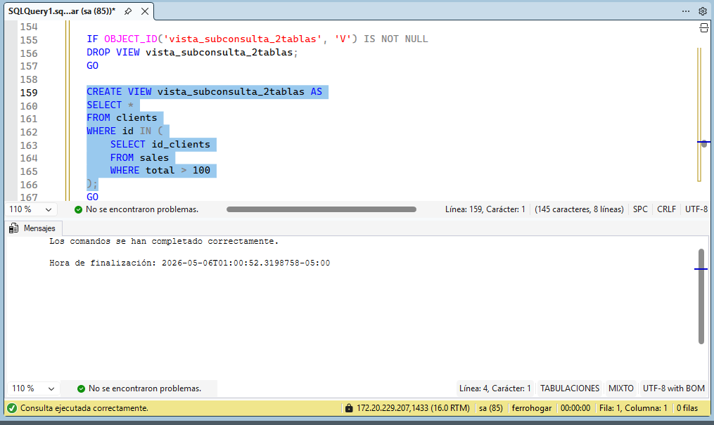Verificación:

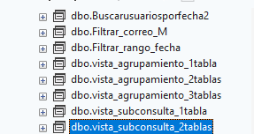

Source:

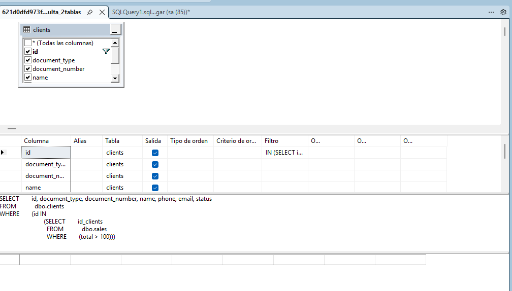

Datos:

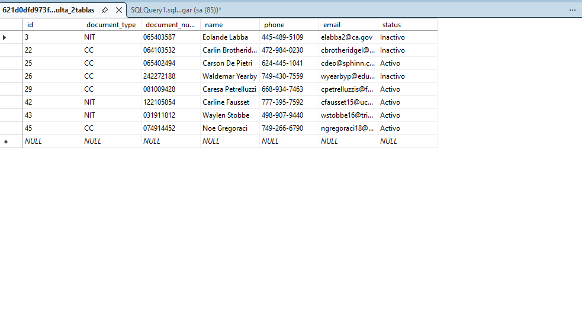

------------------------------------------------------------------------

### ⚙️ Procedimiento

``` sql
IF OBJECT_ID('proc_subconsulta_2tablas', 'P') IS NOT NULL DROP PROCEDURE proc_subconsulta_2tablas; GO  CREATE PROCEDURE proc_subconsulta_2tablas AS BEGIN     SELECT *     FROM clients     WHERE id IN (         SELECT id_clients         FROM sales         WHERE total > 100     ); END; GO
```

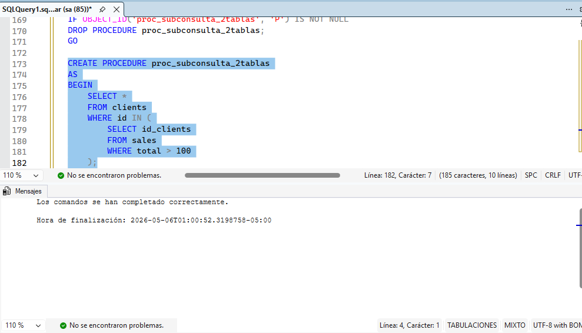

Verificación:

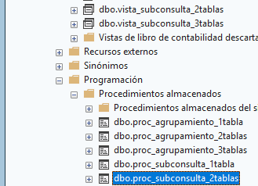

Source:

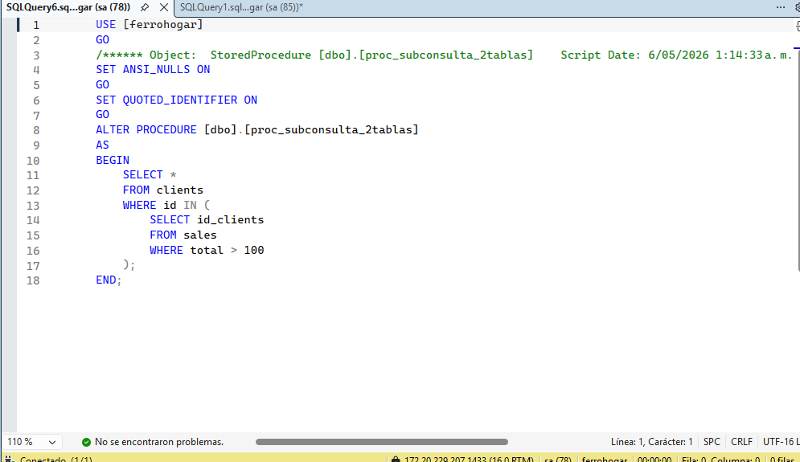

------------------------------------------------------------------------

## 4.3 Subconsulta con 3 tablas

``` sql
SELECT * FROM clients WHERE id IN (     SELECT V.id_clients     FROM sales V     JOIN sales_details PV ON V.id = PV.id_sales     WHERE PV.quantity >= 5 );
```

Muestra los clientes que han comprado productos con cantidad mayor o igual a 5.

------------------------------------------------------------------------

### 🔹 Vista

``` sql
IF OBJECT_ID('vista_subconsulta_3tablas', 'V') IS NOT NULL DROP VIEW vista_subconsulta_3tablas; GO  CREATE VIEW vista_subconsulta_3tablas AS SELECT * FROM clients WHERE id IN (     SELECT V.id_clients     FROM sales V     JOIN sales_details PV ON V.id = PV.id_sales     WHERE PV.quantity >= 5 ); GO
```

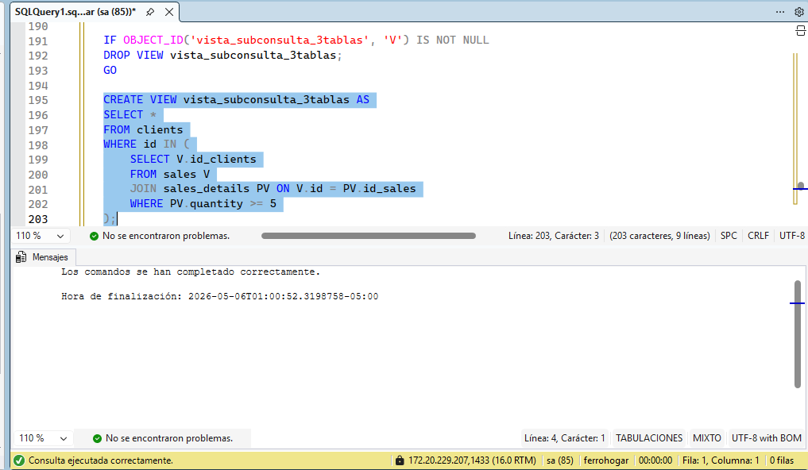

Verificación:

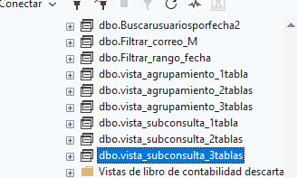

Source:

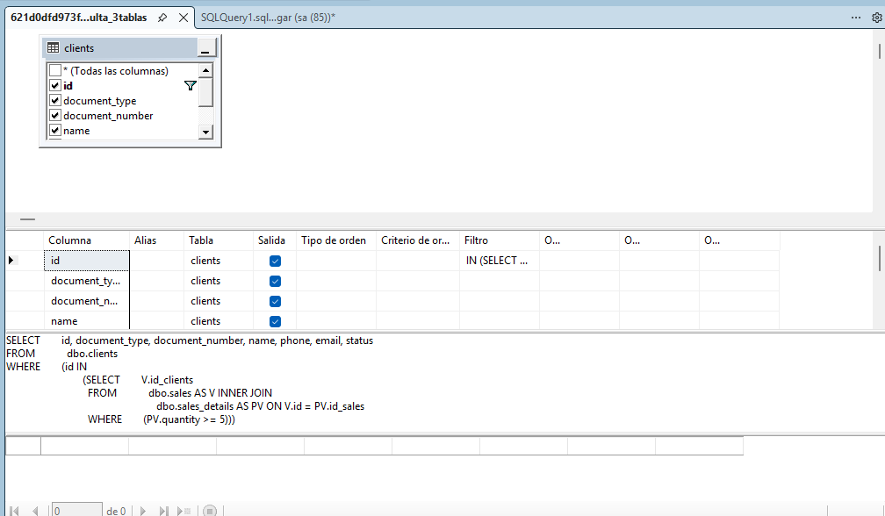

Datos:

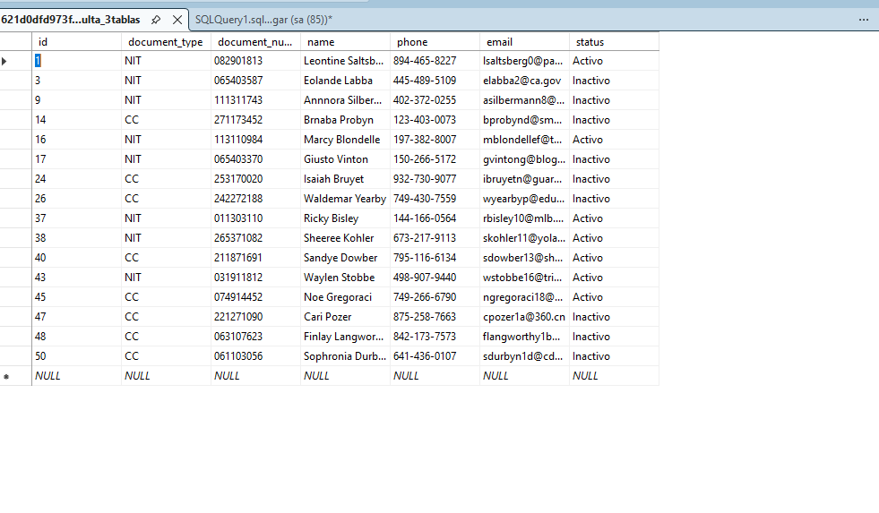

------------------------------------------------------------------------

### ⚙️ Procedimiento

``` sql
IF OBJECT_ID('proc_subconsulta_3tablas', 'P') IS NOT NULL DROP PROCEDURE proc_subconsulta_3tablas; GO  CREATE PROCEDURE proc_subconsulta_3tablas AS BEGIN     SELECT *     FROM clients     WHERE id IN (         SELECT V.id_clients         FROM sales V         JOIN sales_details PV ON V.id = PV.id_sales         WHERE PV.quantity >= 5     ); END; GO
```

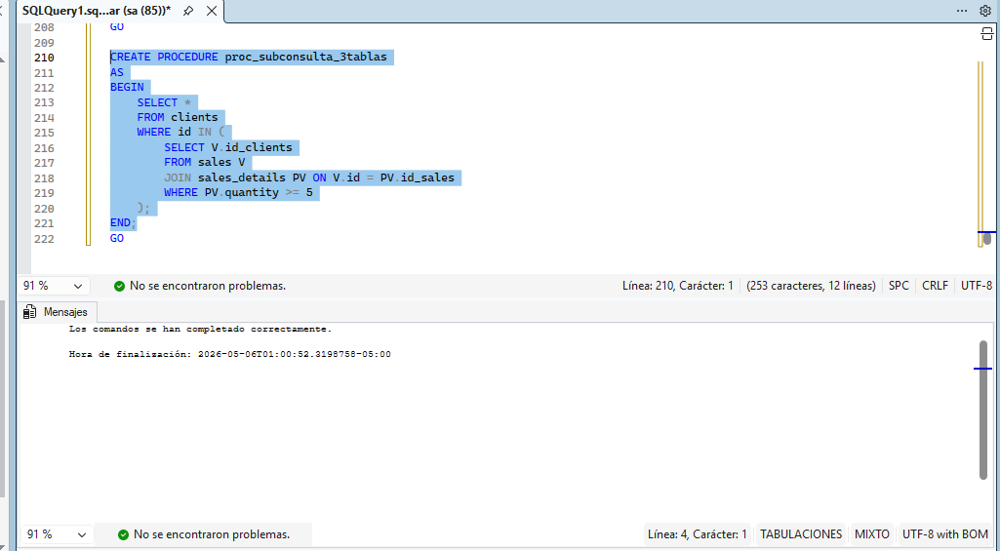

Verificación:

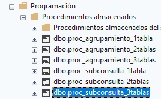

Source:

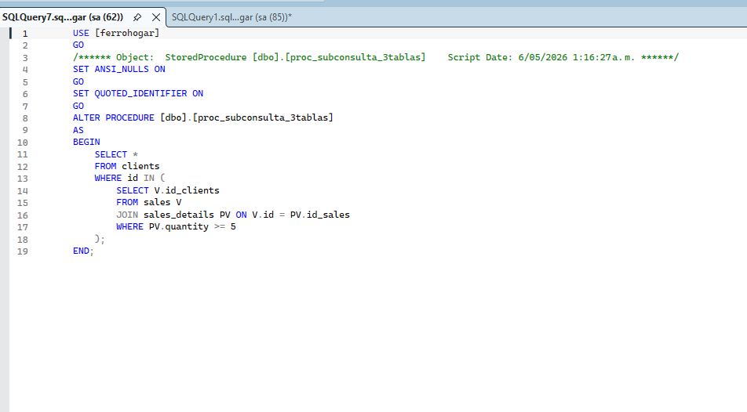

------------------------------------------------------------------------

Aquí concluimos la actividad realizada mediante Sql Management utilizando el motor SQL Server
